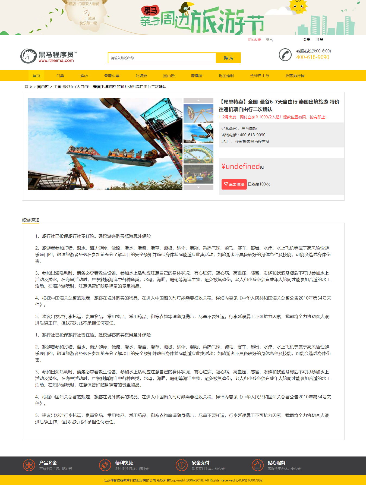
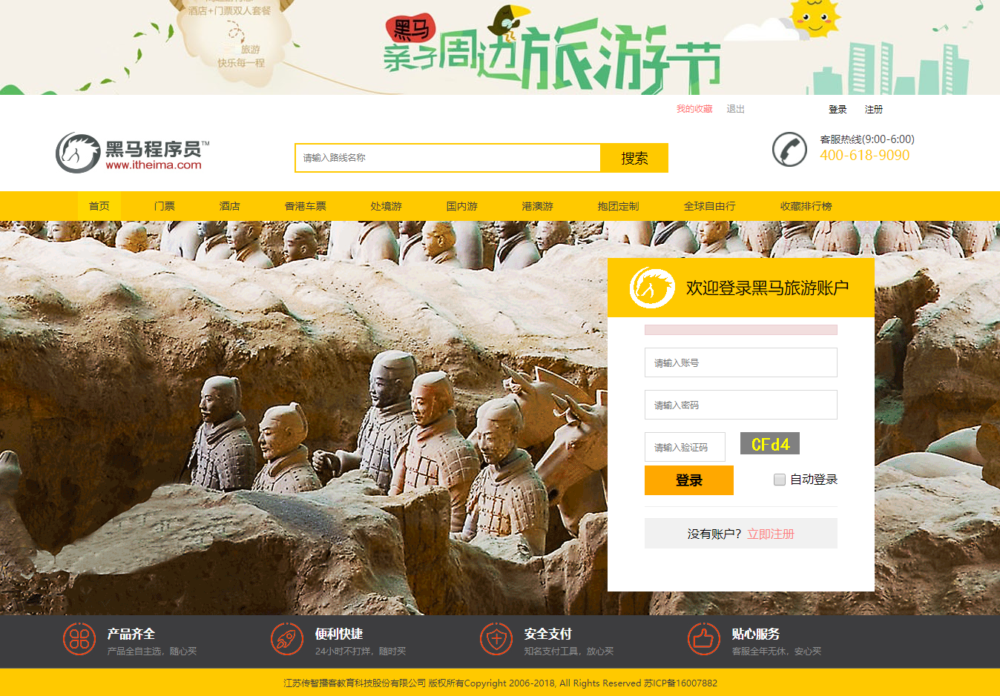

## 项目简介

>项目来源于：[https://gitee.com/haoshunyu/travel](https://gitee.com/haoshunyu/travel)

**作者介绍**

本系统是基于**Maven+JSP+Servlet+JdbcTemplate+Redis+Mysql**实现的旅游网站，是黑马培训时的实战项目。使用的技术偏多，但是网站内容很简单，容易理解。

**难度等级：困难**

## 技术栈

### 编辑器

IntelliJ IDEA 2019.1.1 (Ultimate Edition)

### 前端技术

基础：html+css+JavaScript

框架：[Bootstrap](https://www.bootcss.com/)+[JQuery](https://www.runoob.com/jquery/jquery-tutorial.html)

### 后端技术

JSP+Servlet

数据库连接池：Druid

JDBC工具：JdbcTemplate

数据库：mysql 5.7.27（个人测试使用）

缓存：redis 3.2.1（个人测试使用）

jdk版本：1.8.0_181（个人测试使用）

tomcat版本： tomcat 8.5.34（个人测试使用）


## 本地运行

> 若有疑惑可查看[视频版本](https://zhuanlan.zhihu.com/p/134288585)。

1.下载zip直接解压或安装git后执行克隆命令 
```
git clone https://gitee.com/haoshunyu/travel.git
```
2.使用idea打开项目，配置maven、jdk即可。

3.打开Navicat For Mysql，创建**travel**数据库，并运行**travel/src/main/resources/travel.sql**。

4.修改**travel/src/main/resources/druid.properties**中数据库相关的内容。

5.修改**travel/src/main/resources/jedis.properties**中Redis相关的内容。

6..发布到tomcat中，具体访问链接看tomcat配置，若未修改则[http://localhost:8080/travel](http://localhost:8080/travel)为首页。


## 注意
- 该项目未声明mysql、jdk使用版本，以上版本号均为个人测试使用版本。
- 注意修改**travel/src/main/resources/druid.properties**中数据库相关的内容。
- 注意修改**travel/src/main/resources/jedis.properties**中redis相关的内容。


## 项目截图




## 声明
- 该项目收集于gitee，本人只是代为说明使用技术、注意点及启动方式，帮助大家进行学习交流。
- **若通过gitee地址无法下载该项目或无法正常运行，可私信我，本人免费协助。**


#### 推荐阅读
- [JSP+Servlet+JDBC+DBCP2实现在线购书系统](https://mp.weixin.qq.com/s/kFHzkRtL6FNN9koaWAjDkg)
- [JSP+Servlet+JDBC实现的shine网上书城](https://mp.weixin.qq.com/s/GvfywZwg28IMYk5Q2ZWcOw)
- [JSP+Servlet+JDBC实现的云端汽修后台管理系统](https://mp.weixin.qq.com/s/kalGv5T8AZGxTnLHr2wDsA)
- [JSP+Servlet+JDBC实现的学生信息管理系统](https://mp.weixin.qq.com/s/K-H50joCXeE0cnwmtoqhJw)
- [JSP+Servlet+C3P0+Mysql实现的YCU movies电影网站](https://mp.weixin.qq.com/s/bJ1lGNDrVwzXx5z9dDaV-w)
- [JSP+Servlet+C3P0+Mysql实现的图书馆管理系统](https://mp.weixin.qq.com/s/MdGVYX_8t-CiOasghGPrRw)

---

本篇已收录于个人GitHub仓库[https://github.com/coderzcr/JavaWeb-Project-Source-Share](https://github.com/coderzcr/JavaWeb-Project-Source-Share)，欢迎Star。


欢迎关注我的公众号“**张有路**”，原创技术文章第一时间推送。


