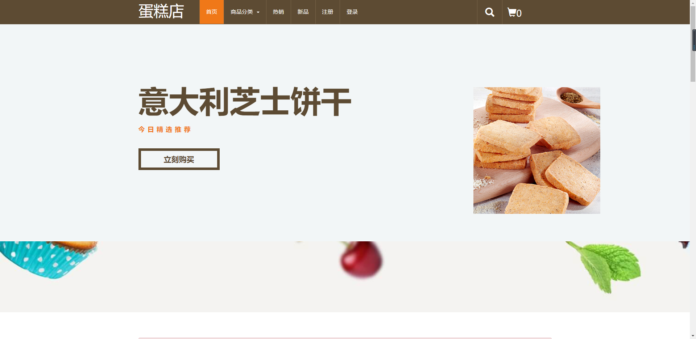
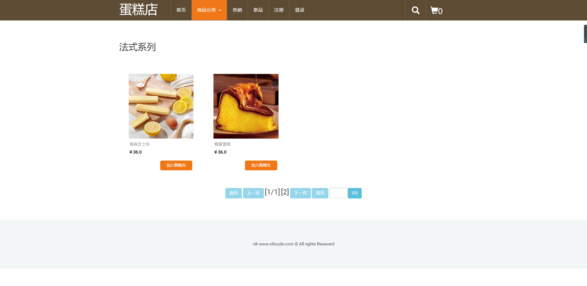
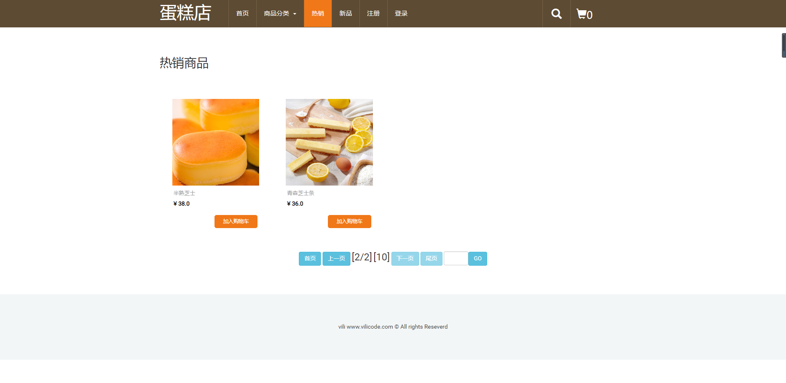
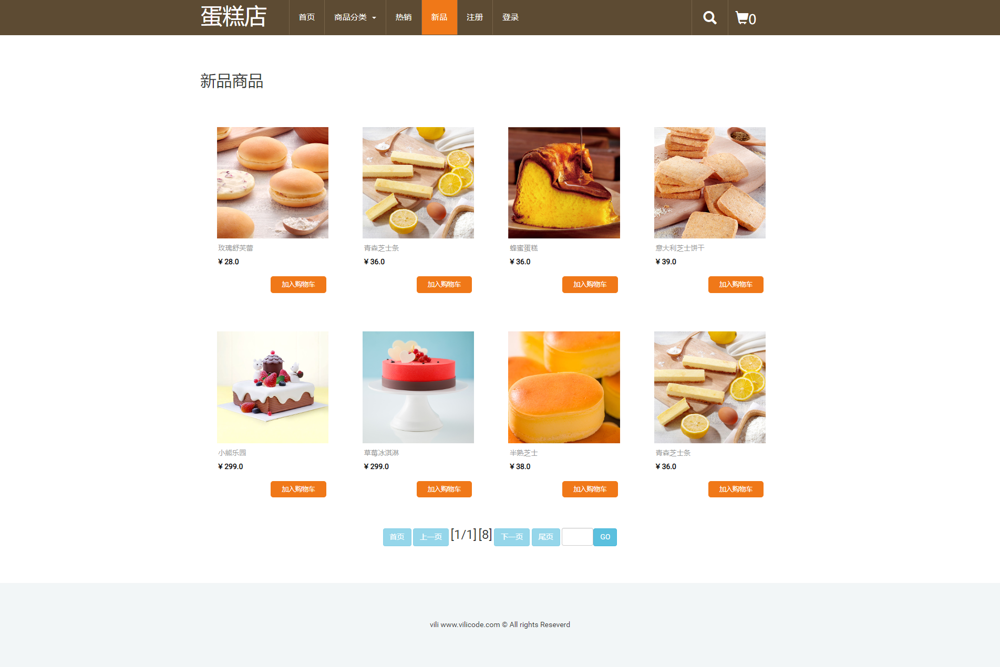
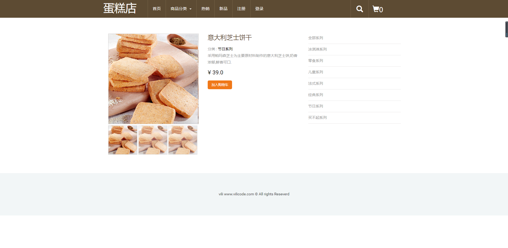
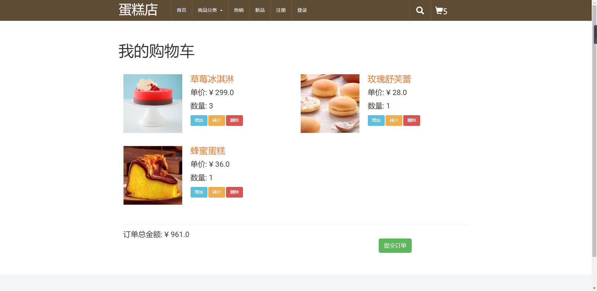
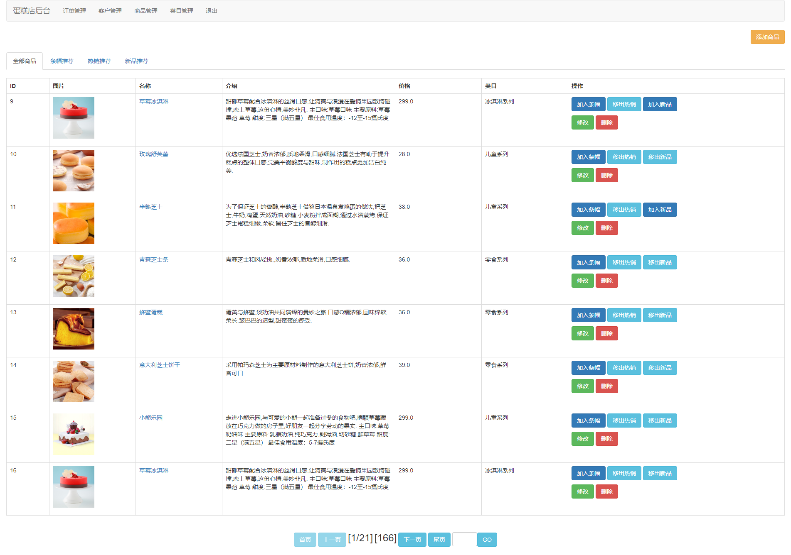

>  **本文存在[视频版本](https://zhuanlan.zhihu.com/p/118471309),请知悉**

----------

## 项目简介

>项目来源于：[https://gitee.com/PositiveMumu/CakesShop/tree/master](https://gitee.com/PositiveMumu/CakesShop/tree/master)

这次分享一个蛋糕商场系统，还是很简单的系统。界面简洁但不粗糙。。

本系统基于**JSP+Servlet+C3P0+Mysql+JDBC**。涉及技术少，易于理解，适合**JavaWeb初学者**学习使用。

**难度等级：简单**

## 技术栈

### 编辑器

IntelliJ IDEA 2019.1.1 (Ultimate Edition)

### 前端技术
基础：html+css+JavaScript

框架：[BootStrap](https://www.bootcss.com/)+[JQuery](https://jquery.com/)+[simpleCart](http://www.simplecartjs.com/)

### 后端技术
Jsp+Servlet

数据库：mysql 5.7.27（个人测试使用）

jdk版本：1.8.0_181（个人测试使用）

tomcat版本：8.5.34（个人测试使用）


## 本地运行

1.下载zip直接解压或安装git后执行克隆命令 
```
https://gitee.com/PositiveMumu/CakesShop.git
```
2.使用Idea打开项目，配置jdk、tomcat和所需jar包。
项目所依赖jar包在**web/WEB-INF/lib**文件夹下。

3.打开Navicat For Mysql，创建cakeshop数据库，复制**Cakeshop.sql**中的文件内容运行。

4.修改**c3p0-config.xml**中数据库相关的内容。若不会改可粘贴以下内容。

```xml
<?xml version="1.0" encoding="UTF-8"?>
<c3p0-config>
	<!-- 默认配置，只可以出现一次 -->
	<default-config>
		<property name="driverClass">com.mysql.jdbc.Driver</property>
		<property name="jdbcUrl">
			<![CDATA[jdbc:mysql://localhost:3306/cakeshop?useUnicode=true&characterEncoding=UTF-8]]>
		</property>
		<property name="user">root</property>
		<property name="password">root</property>
	</default-config>
</c3p0-config>
```


5.发布到tomcat中，具体访问链接看tomcat配置，若未修改则[http://localhost:8080/](http://localhost:8080/)为首页。
管理员初始账号：admin
管理员初始密码：admin


## 注意
- 该项目未声明mysql、jdk、tomcat使用版本，以上版本号均为个人测试使用版本。
- 注意**修改c3p0-config.xml**数据库相关的内容。**


## 项目截图







## 声明
- 该项目收集于gitee，本人只是代为说明使用技术、注意点及启动方式，帮助大家进行学习交流。
- **若通过gitee地址无法下载该项目或无法正常运行，可私信我，本人免费协助。**


#### 推荐阅读
- [JSP+Servlet+JDBC+DBCP2实现在线购书系统](https://mp.weixin.qq.com/s/kFHzkRtL6FNN9koaWAjDkg)
- [JSP+Servlet+JDBC实现的shine网上书城](https://mp.weixin.qq.com/s/GvfywZwg28IMYk5Q2ZWcOw)
- [JSP+Servlet+JDBC实现的云端汽修后台管理系统](https://mp.weixin.qq.com/s/kalGv5T8AZGxTnLHr2wDsA)
- [JSP+Servlet+JDBC实现的学生信息管理系统](https://mp.weixin.qq.com/s/K-H50joCXeE0cnwmtoqhJw)
- [JSP+Servlet+C3P0+Mysql实现的YCU movies电影网站](https://mp.weixin.qq.com/s/bJ1lGNDrVwzXx5z9dDaV-w)
- [JSP+Servlet+C3P0+Mysql实现的图书馆管理系统](https://mp.weixin.qq.com/s/MdGVYX_8t-CiOasghGPrRw)

---

欢迎关注我的公众号“**张有路**”，原创技术文章第一时间推送。


