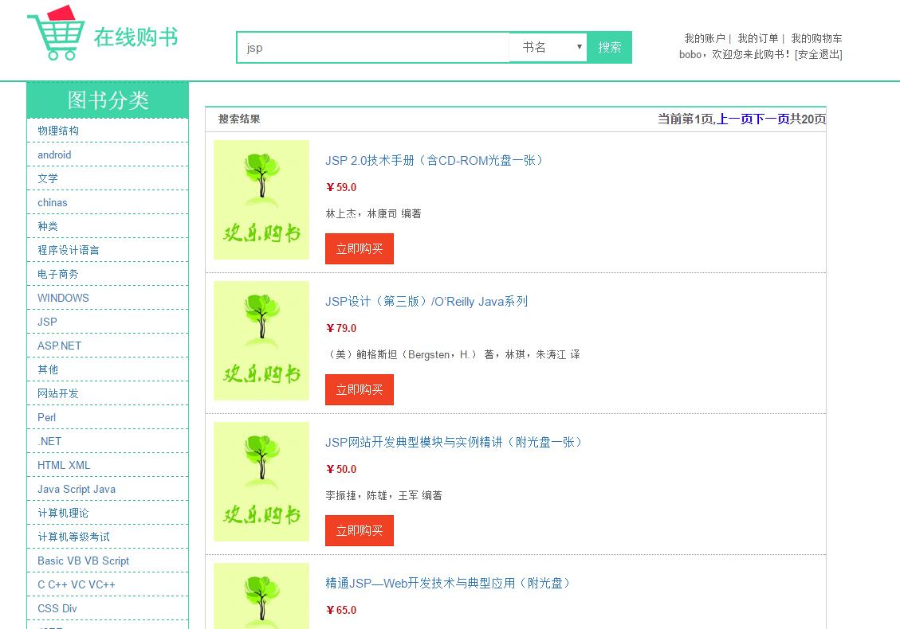
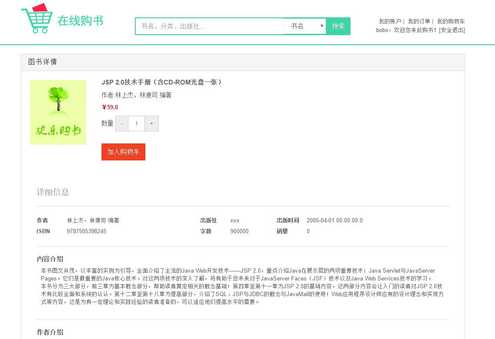
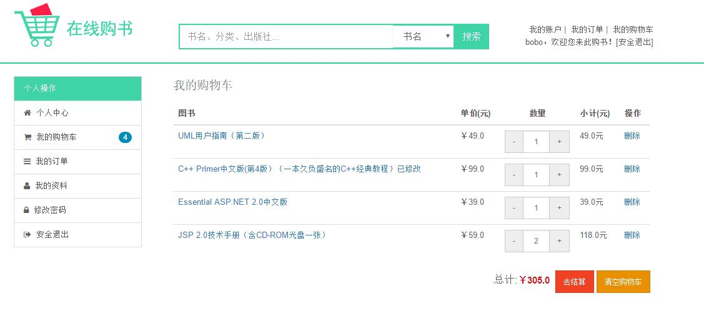
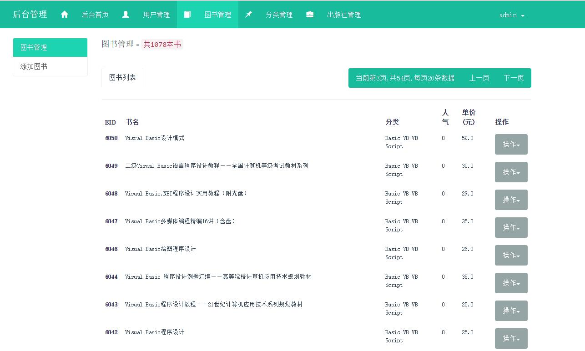
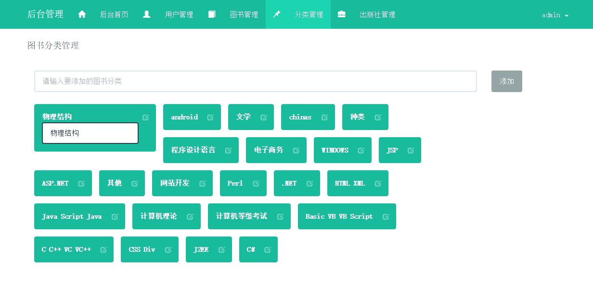

## 项目简介
[导入项目包含视频版本，更易懂][1]

----------
>项目来源于：[https://gitee.com/suimz_admin/BookShop](https://gitee.com/suimz_admin/BookShop)

一个基于JSP+Servlet+Jdbc的书店系统。涉及技术少，易于理解，适合JavaWeb初学者学习使用。
**本人亲测可正常启动。**

**难度等级：中等**

## 技术栈
### 编辑器

Eclipse Version: 2019-12 (4.14.0)

### 前端技术

基础：html+css+JavaScript

框架：Jquery和BootStrap

### 后端技术

jsp+servlet

数据库：mysql 5.7.27（个人测试使用）

连接池：DBCP2

jdk版本：1.8.0_181（个人测试使用）

tomcat版本：8.5.34（个人测试使用）

## 本地运行
### Eclipse环境准备

1.[eclipse新增jdk][2]

2.[eclipse新增tomcat][3]

### 导入项目
1. 下载zip直接解压或安装git后执行克隆命令 git clone https://gitee.com/suimz_admin/BookShop.git
2. 使用eclipse打开项目，并配置jdk版本和所需jar包。项目所依赖jar包在WebContent/WEB-INF/lib文件夹下。
3. MySQL数据库新建 mybookshop 数据库，并运行项目导入说明中的mybookshop.sql文件。
4. 将项目导入说明文件夹下的context.xml移入WebContent/META-INF文件夹中，并修改该文件中的数据库连接配置。
5. 发布到tomcat中，[http://localhost:8080/BookShop/](http://localhost:8080/BookShop/)为买家首页。[http://localhost:8080/BookShop/admin/](http://localhost:8080/BookShop/admin/)为管理员首页。

初始账号：admin  初始密码：123456

## 注意
- 该项目未声明mysql、jdk、tomcat使用版本，以上版本号均为个人测试使用版本。
- 因tomcat8中内置数据库连接池为DBCP2，该项目中context.xml的配置maxActive更改maxTotal，maxWait更改为maxWaitMillis。
**若使用tomcat8以下版本，则无需更改。**

## 项目截图

## 声明
- 该项目收集于gitee，本人只是代为说明使用技术、注意点及启动方式，帮助大家进行学习交流。
- 项目截图来源于[https://gitee.com/suimz_admin/BookShop](https://gitee.com/suimz_admin/BookShop)
- **若通过gitee地址无法下载该项目或无法正常运行，可关注VX公众号：码农张，获取本人联系方式，本人免费协助。**

  [1]: https://zhuanlan.zhihu.com/p/104589778
  [2]: ../../public/oldPicturesFromGitee/Eclipse%E6%96%B0%E5%A2%9Ejdk.mp4
  [3]: ../../public/oldPicturesFromGitee/Eclipse%E6%96%B0%E5%A2%9Etomcat.mp4