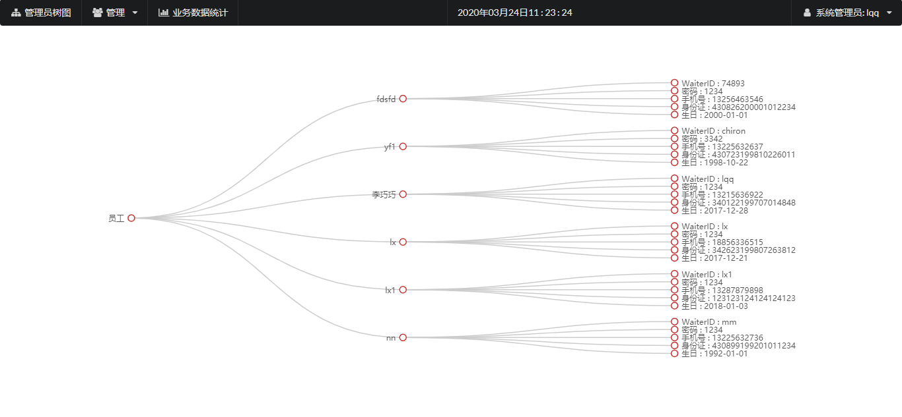
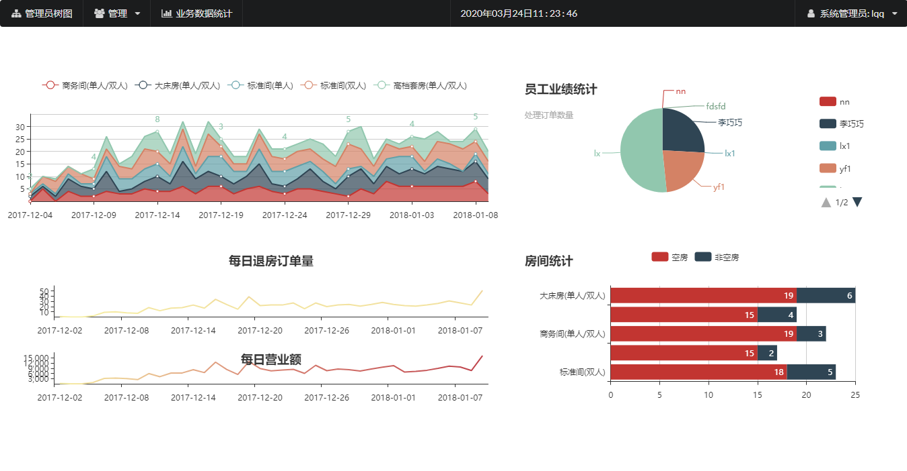
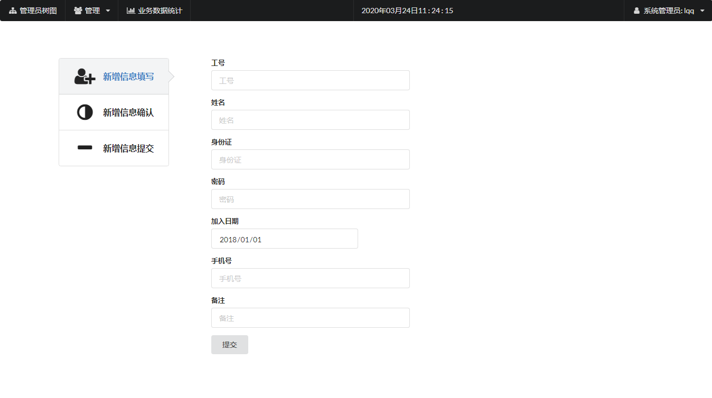
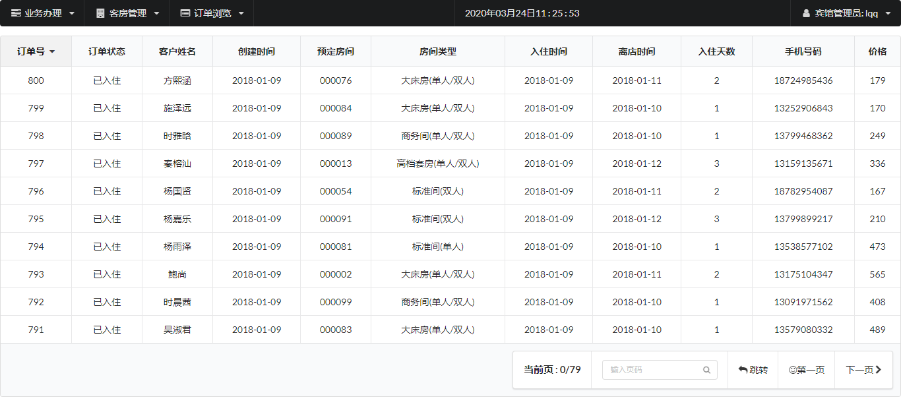

>  **本文存在[视频版本](https://zhuanlan.zhihu.com/p/115893887),请知悉**

----------

## 项目简介

>项目来源于：[https://github.com/mafulong/databaseExper-hotelMaster](https://github.com/mafulong/databaseExper-hotelMaster)

这次分享的也是毕设或课程设计选择一样很多的宾馆管理系统，适合新手入门。

本系统基于**JSP+Servlet+Mysql+Maven**。涉及技术少，易于理解，适合**JavaWeb初学者**学习使用。

**难度等级：中等**

## 技术栈

### 编辑器

IntelliJ IDEA 2019.1.1 (Ultimate Edition)

### 前端技术
基础：html+css+JavaScript

框架：[Semantic UI](https://1.semantic-ui.com/)+[JQuery](https://jquery.com/)+[Apache ECharts](https://www.echartsjs.com/zh/index.html)

### 后端技术
Jsp+Servlet

数据库：mysql 5.7.27（个人测试使用）

jdk版本：1.8.0_181（个人测试使用）

tomcat版本：9.0.33（个人测试使用）

项目构建：Maven 3.5.2（个人测试使用）

## 本地运行
1.下载zip直接解压或安装git后执行克隆命令 
```
https://github.com/mafulong/databaseExper-hotelMaster.git
```
**若下载过慢可将github仓库复制到gitee上。** [查看视频](../../public/oldPicturesFromGitee/GitHub下载慢怎么办？.mp4)

2.使用Idea打开项目，配置maven，如果maven中央仓库下载过慢可以新建镜像映射到阿里云的中央仓库，具体细节不细说啦。

3.配置jdk、tomcat和所需jar包。

4.打开Navicat For Mysql，新建名称为**new**的数据库，运行**数据库代码\hotelCreateDB.sql和数据库代码\hotelCreateData.sql**文件。先后顺序不可更改。

5.修改**config.GCON**类中数据库相关的内容。**sql文件里新建了代码所需用户，故只修改数据库名称即可**

6.发布到tomcat中，具体访问链接看tomcat配置，若未修改则[http://localhost:8080](http://localhost:8080)为登录页面。
系统有2种权限：系统管理员、宾馆管理员。
系统管理员初始账号：lqq 系统管理员初始密码：1234
宾馆管理员初始账号：lqq   宾馆管理员初始密码：1234


## 注意
- 该项目未声明mysql、jdk、tomcat使用版本，以上版本号均为个人测试使用版本。
- 注意**修改config.GCON中数据库相关的内容。**
- 运行**数据库代码\hotelCreateDB.sql和数据库代码\hotelCreateData.sql**文件时，**先后顺序不可更改**。


## 项目截图







## 声明
- 该项目收集于github，本人只是代为说明使用技术、注意点及启动方式，帮助大家进行学习交流。
- **若通过github地址无法下载该项目或无法正常运行，可私信我，本人免费协助。**


#### 推荐阅读
- [JSP+Servlet+JDBC+DBCP2实现在线购书系统](https://mp.weixin.qq.com/s/kFHzkRtL6FNN9koaWAjDkg)
- [JSP+Servlet+JDBC实现的shine网上书城](https://mp.weixin.qq.com/s/GvfywZwg28IMYk5Q2ZWcOw)
- [JSP+Servlet+JDBC实现的云端汽修后台管理系统](https://mp.weixin.qq.com/s/kalGv5T8AZGxTnLHr2wDsA)
- [JSP+Servlet+JDBC实现的学生信息管理系统](https://mp.weixin.qq.com/s/K-H50joCXeE0cnwmtoqhJw)
- [JSP+Servlet+C3P0+Mysql实现的YCU movies电影网站](https://mp.weixin.qq.com/s/bJ1lGNDrVwzXx5z9dDaV-w)
- [JSP+Servlet+C3P0+Mysql实现的图书馆管理系统](https://mp.weixin.qq.com/s/MdGVYX_8t-CiOasghGPrRw)

---

欢迎关注我的公众号“**张有路**”，原创技术文章第一时间推送。


