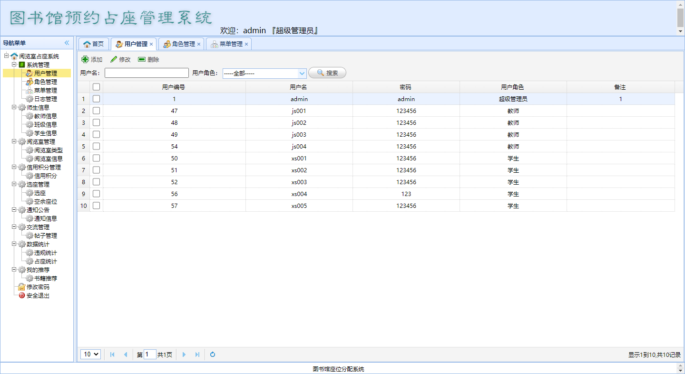
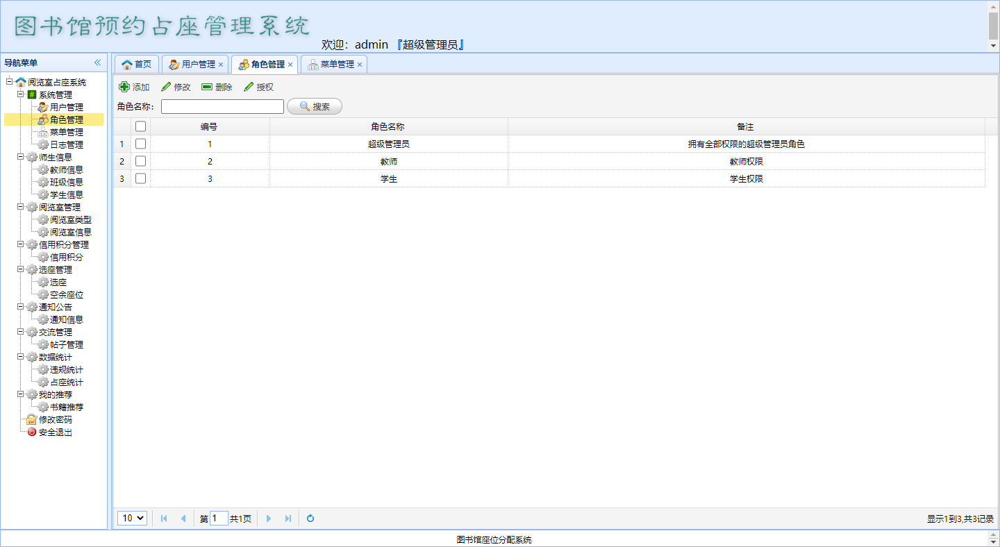
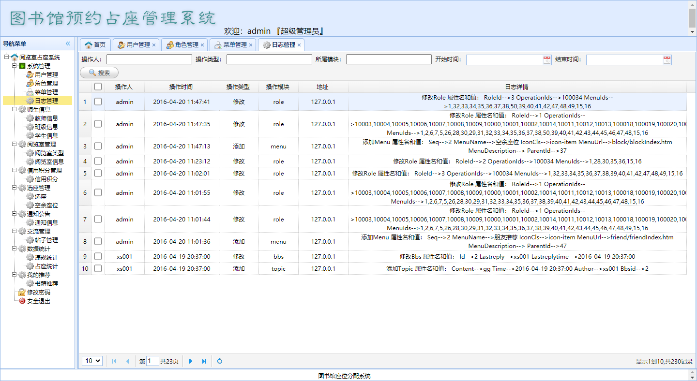
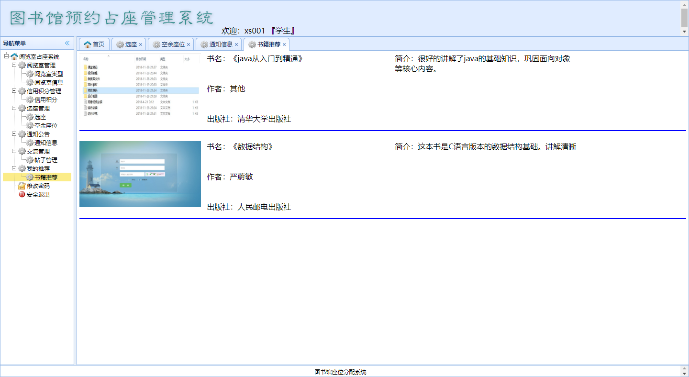

## 项目简介

>项目来源于：[https://gitee.com/gepanjiang/LibrarySeats](https://gitee.com/gepanjiang/LibrarySeats)

**因原gitee仓库无数据库文件且存在水印，经过本人修改，现将该仓库重新上传至个人gitee仓库。**
[https://gitee.com/coderzcr/LibrarySeats](https://gitee.com/coderzcr/LibrarySeats)

本系统基于**JSP+SSM+Mysql**实现的图书馆预约占座管理系统。主要实现的功能有：用户管理、菜单管理、角色管理、权限管理、学生管理、教师管理、班级管理、图书馆阅览室管理、学生信用管理、预约占座管理、发帖评论管理、违规统计、占座预约统计等，添加学生和教师时会自动在用户表中注册，定时任务会定时生成座位信息，阅览室分类中可设置信用等级，学生被扣分后信用等级低于相应的值后不能预约相应的阅览室座位。

**难度等级：中等**

## 技术栈

### 编辑器

Eclipse Version: 2020-03 (4.15.0)

### 前端技术

基础：html+css+JavaScript

框架：[JQuery](https://www.runoob.com/jquery/jquery-tutorial.html)+[EasyUI](http://www.jeasyui.com/)

### 后端技术

Spring+SpringMVC+mybatis

模板引擎：JSP

数据库：mysql 5.7.27（个人测试使用）

jdk版本：1.8.0_251（个人测试使用）

tomcat版本：8.5.34（个人测试使用）


## 本地运行

### Eclipse环境准备
1.[eclipse新增jdk](../../public/oldPicturesFromGitee/Eclipse%E6%96%B0%E5%A2%9Ejdk.mp4)

2.[eclipse新增tomcat](../../public/oldPicturesFromGitee/Eclipse%E6%96%B0%E5%A2%9Etomcat.mp4)

### 导入项目

> 若有疑惑可查看[视频版本](https://zhuanlan.zhihu.com/p/142867926)。

1.下载zip直接解压或安装git后执行克隆命令。
```
git clone https://gitee.com/coderzcr/LibrarySeats.git
```
2.使用eclipse导入项目，配置jdk、tomcat和所需jar包。
项目所依赖jar包在**WebContent/WEB-INF/lib**文件夹下。

3.打开Navicat For Mysql，创建db_library_seats数据库，并运行**WebContent/sql/db_library_seats.sql**。

4.修改**config.properties**中数据库相关的内容。

5.发布到tomcat中，具体访问链接看tomcat配置，若未修改则[http://localhost:8080/LibrarySeats/](http://localhost:8080/LibrarySeats/)为登录页面。

管理员账户：admin 管理员密码：admin


## 注意
- 该项目未声明mysql、jdk、tomcat使用版本，以上版本号均为个人测试使用版本。
- 注意**修改config.properties**中数据库相关的内容。


## 项目截图








## 声明
- 该项目收集于github，本人只是代为说明使用技术、注意点及启动方式，帮助大家进行学习交流。
- **若通过gitee地址无法下载该项目或无法正常运行，可私信我，本人免费协助。**


#### 推荐阅读
- [JSP+Servlet+JDBC+DBCP2实现在线购书系统](https://mp.weixin.qq.com/s/kFHzkRtL6FNN9koaWAjDkg)
- [JSP+Servlet+JDBC实现的shine网上书城](https://mp.weixin.qq.com/s/GvfywZwg28IMYk5Q2ZWcOw)
- [JSP+Servlet+JDBC实现的云端汽修后台管理系统](https://mp.weixin.qq.com/s/kalGv5T8AZGxTnLHr2wDsA)
- [JSP+Servlet+JDBC实现的学生信息管理系统](https://mp.weixin.qq.com/s/K-H50joCXeE0cnwmtoqhJw)
- [JSP+Servlet+C3P0+Mysql实现的YCU movies电影网站](https://mp.weixin.qq.com/s/bJ1lGNDrVwzXx5z9dDaV-w)
- [JSP+Servlet+C3P0+Mysql实现的图书馆管理系统](https://mp.weixin.qq.com/s/MdGVYX_8t-CiOasghGPrRw)

---

本篇已收录于个人GitHub仓库[https://github.com/coderzcr/JavaWeb-Project-Source-Share](https://github.com/coderzcr/JavaWeb-Project-Source-Share)，欢迎Star。


欢迎关注我的公众号“**张有路**”，原创技术文章第一时间推送。


