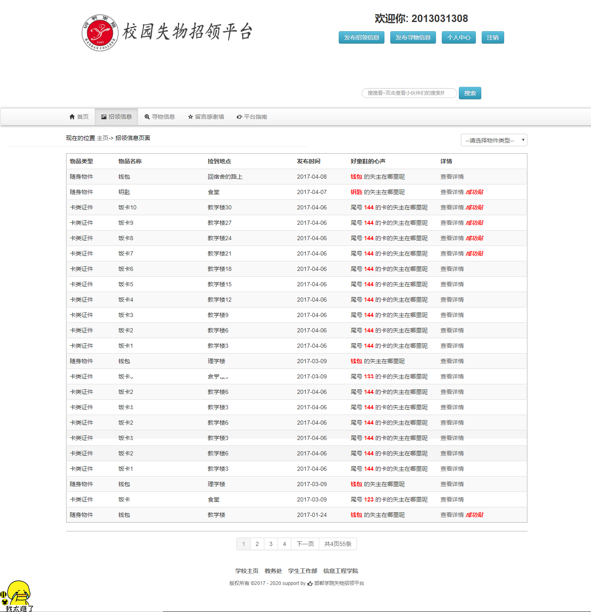
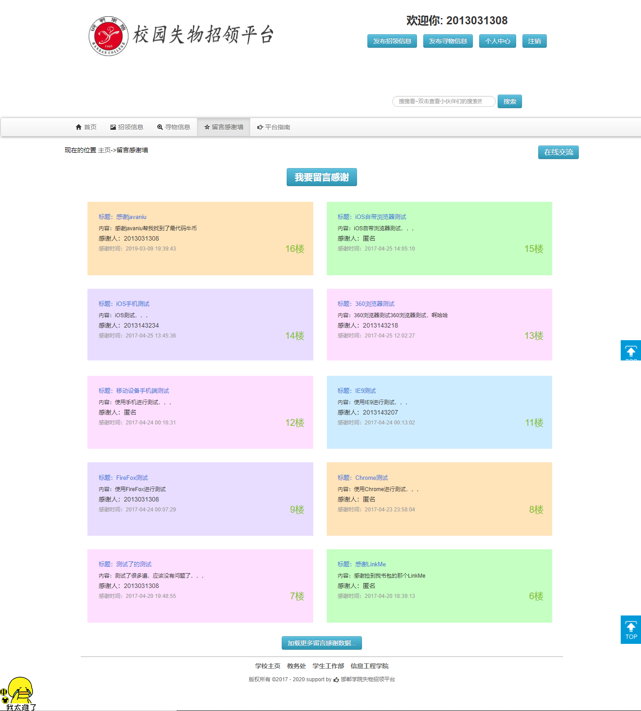
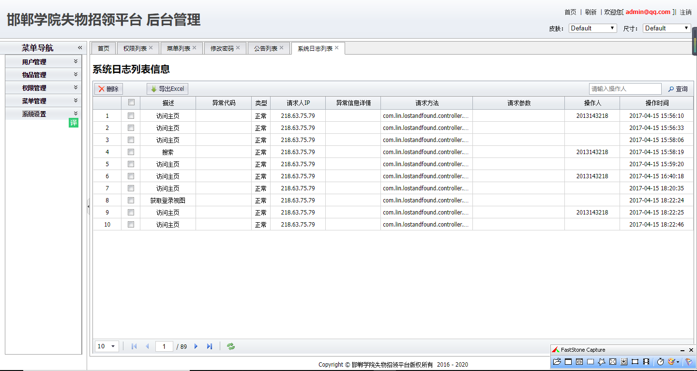

## 项目简介

>项目来源于：[https://github.com/wenlongup/LostAndFound](https://github.com/wenlongup/LostAndFound)

**因原github仓库无数据库文件，经过本人修改，现将该仓库重新上传至个人gitee仓库。**
[https://gitee.com/coderzcr/LostAndFound](https://gitee.com/coderzcr/LostAndFound)

本系统基于**JSP+Spring+SpringMVC+Hibernate+Mysql**的校园失物招领网站。本系统没有使用常用的SSM或者SSH框架，而是
以Spring+SpringMVC+Hibernate三个框架结合来完成。这样能完美诠释框架是服务于服务，只要某个框架利于您的开发进程，就不必拘泥于框架，使用最熟练最高效的即可。

**难度等级：中等**

## 技术栈

### 编辑器

Eclipse Version: 2019-12 (4.14.0)

### 前端技术

基础：html+css+JavaScript

框架：[JQuery](https://www.runoob.com/jquery/jquery-tutorial.html)+[EasyUI](http://www.jeasyui.com/)

### 后端技术

Spring+SpringMVC+Hibernate

模板引擎：JSP

数据库连接池：C3P0

数据库：mysql 5.7.27（个人测试使用）

jdk版本：1.8.0_181（个人测试使用）

tomcat版本：8.5.34（个人测试使用）


## 本地运行

### Eclipse环境准备
1.[eclipse新增jdk](../../public/oldPicturesFromGitee/Eclipse%E6%96%B0%E5%A2%9Ejdk.mp4)

2.[eclipse新增tomcat](../../public/oldPicturesFromGitee/Eclipse%E6%96%B0%E5%A2%9Etomcat.mp4)

### 导入项目

> 若有疑惑可查看[视频版本](https://zhuanlan.zhihu.com/p/138481010)。

1.下载zip直接解压或安装git后执行克隆命令。
```
git clone https://gitee.com/coderzcr/LostAndFound.git
```
2.使用eclipse导入项目，配置jdk、tomcat和所需jar包。
项目所依赖jar包在**WebContent/WEB-INF/lib**文件夹下。

3.打开Navicat For Mysql，创建lostandfound数据库，并运行**sql/lostandfound.sql**。

4.修改**resource\database.properties**中数据库相关的内容。

5.发布到tomcat中，具体访问链接看tomcat配置，若未修改则[http://localhost:8080/LostAndFound](http://localhost:8080/LostAndFound)为登录页面。
登录账号2013031308 2013031308


[http://localhost:8080/LostAndFound/admin](http://localhost:8080/LostAndFound/admin) 为管理员页面.

账号：admin@qq.com  密码：lgladmin


## 注意
- 该项目未声明mysql、jdk、tomcat使用版本，以上版本号均为个人测试使用版本。
- 注意**修改resource\database.properties**中数据库相关的内容。


## 项目截图







## 声明
- 该项目收集于github，本人只是代为说明使用技术、注意点及启动方式，帮助大家进行学习交流。
- **若通过gitee地址无法下载该项目或无法正常运行，可私信我，本人免费协助。**


#### 推荐阅读
- [JSP+Servlet+JDBC+DBCP2实现在线购书系统](https://mp.weixin.qq.com/s/kFHzkRtL6FNN9koaWAjDkg)
- [JSP+Servlet+JDBC实现的shine网上书城](https://mp.weixin.qq.com/s/GvfywZwg28IMYk5Q2ZWcOw)
- [JSP+Servlet+JDBC实现的云端汽修后台管理系统](https://mp.weixin.qq.com/s/kalGv5T8AZGxTnLHr2wDsA)
- [JSP+Servlet+JDBC实现的学生信息管理系统](https://mp.weixin.qq.com/s/K-H50joCXeE0cnwmtoqhJw)
- [JSP+Servlet+C3P0+Mysql实现的YCU movies电影网站](https://mp.weixin.qq.com/s/bJ1lGNDrVwzXx5z9dDaV-w)
- [JSP+Servlet+C3P0+Mysql实现的图书馆管理系统](https://mp.weixin.qq.com/s/MdGVYX_8t-CiOasghGPrRw)

---

本篇已收录于个人GitHub仓库[https://github.com/coderzcr/JavaWeb-Project-Source-Share](https://github.com/coderzcr/JavaWeb-Project-Source-Share)，欢迎Star。


欢迎关注我的公众号“**张有路**”，原创技术文章第一时间推送。


