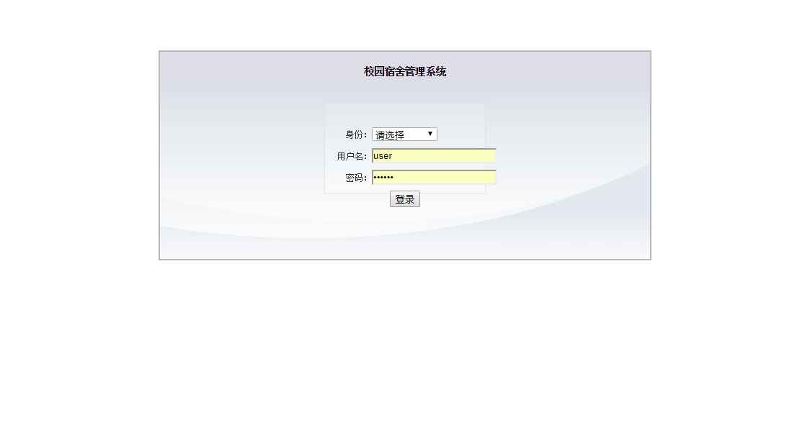
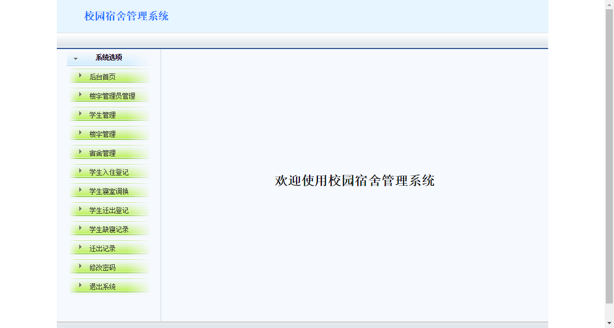
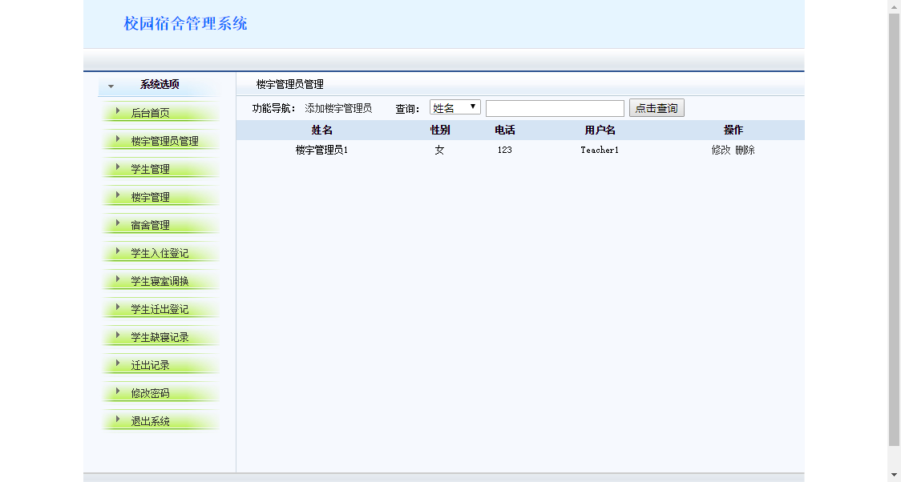
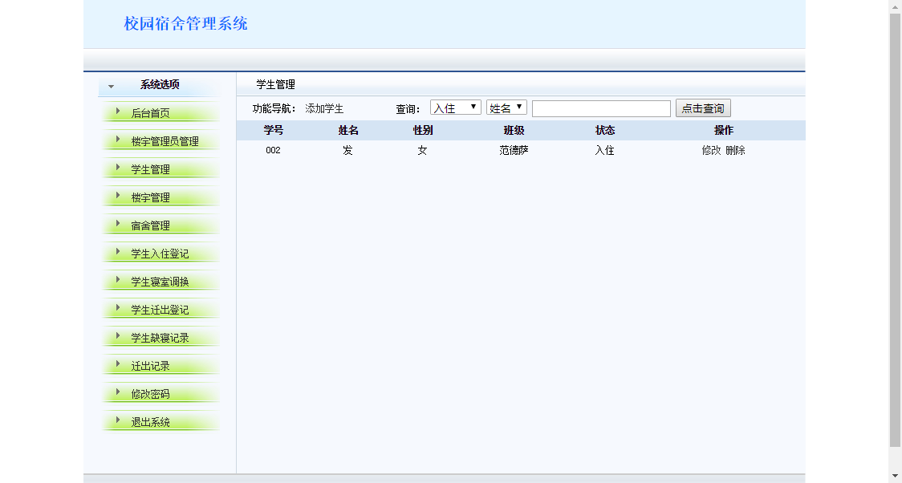
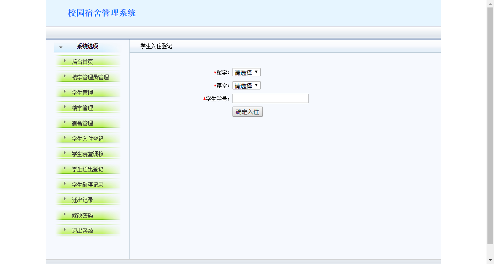

## 项目简介

>项目来源于：[https://gitee.com/passenger134/javaweb-sushe](https://gitee.com/passenger134/javaweb-sushe)

本系统基于**JSP+Struts2+JDBC+Mysql**的校园宿舍管理系统。该系统没有使用全套的SSH框架，只使用了跳转层Struts2，非常适合学习Struts2时使用。

**难度等级：中等**

## 技术栈

### 编辑器

Eclipse Version: 2019-12 (4.14.0)

### 前端技术

基础：html+css+JavaScript

框架：无

### 后端技术

JSP+Struts2+JDBC

数据库：mysql 5.7.27（个人测试使用）

jdk版本：1.8.0_181（个人测试使用）

tomcat版本：8.5.34（个人测试使用）


## 本地运行

### Eclipse环境准备
1.[eclipse新增jdk](../../public/oldPicturesFromGitee/Eclipse%E6%96%B0%E5%A2%9Ejdk.mp4)

2.[eclipse新增tomcat](../../public/oldPicturesFromGitee/Eclipse%E6%96%B0%E5%A2%9Etomcat.mp4)

### 导入项目

> 若有疑惑可查看[视频版本](https://zhuanlan.zhihu.com/p/128597135)。

1.下载zip直接解压或安装git后执行克隆命令 
```
git clone https://gitee.com/passenger134/javaweb-sushe.git
```
2.使用eclipse导入项目，配置jdk、tomcat和所需jar包。
项目所依赖jar包在**WebContent/WEB-INF/lib**文件夹下。

3.打开Navicat For Mysql，运行**sushe.sql**。

4.修改**com.db.DBHelper**中数据库相关的内容。在测试中发现，若sql中存在中文，会导致查询不出的情况，建议将该类中的dbUrl变量设置为如下方式
```java
private String dbUrl="jdbc:mysql://localhost:3306/sushe?characterEncoding=utf-8";
```

5.发布到tomcat中，具体访问链接看tomcat配置，若未修改则[http://localhost:8080/sushe](http://localhost:8080/sushe)为登录页面。
该系统分为3种账号。
系统管理员初始账号：java1234 系统管理员初始密码：123 
楼宇管理员初始账号：Teacher1 楼宇管理员初始密码：123
学生初始账号:002 学生初始密码：123


## 注意
- 该项目未声明mysql、jdk、tomcat使用版本，以上版本号均为个人测试使用版本。
- 注意**修改项目完整代码com.db.DBHelper中数据库相关的内容。**


## 项目截图






## 声明
- 该项目收集于gitee，本人只是代为说明使用技术、注意点及启动方式，帮助大家进行学习交流。
- **若通过gitee地址无法下载该项目或无法正常运行，可私信我，本人免费协助。**


#### 推荐阅读
- [JSP+Servlet+JDBC+DBCP2实现在线购书系统](https://mp.weixin.qq.com/s/kFHzkRtL6FNN9koaWAjDkg)
- [JSP+Servlet+JDBC实现的shine网上书城](https://mp.weixin.qq.com/s/GvfywZwg28IMYk5Q2ZWcOw)
- [JSP+Servlet+JDBC实现的云端汽修后台管理系统](https://mp.weixin.qq.com/s/kalGv5T8AZGxTnLHr2wDsA)
- [JSP+Servlet+JDBC实现的学生信息管理系统](https://mp.weixin.qq.com/s/K-H50joCXeE0cnwmtoqhJw)
- [JSP+Servlet+C3P0+Mysql实现的YCU movies电影网站](https://mp.weixin.qq.com/s/bJ1lGNDrVwzXx5z9dDaV-w)
- [JSP+Servlet+C3P0+Mysql实现的图书馆管理系统](https://mp.weixin.qq.com/s/MdGVYX_8t-CiOasghGPrRw)

---

本篇已收录于个人GitHub仓库[https://github.com/coderzcr/JavaWeb-Project-Source-Share](https://github.com/coderzcr/JavaWeb-Project-Source-Share)，欢迎Star。


欢迎关注我的公众号“**张有路**”，原创技术文章第一时间推送。


