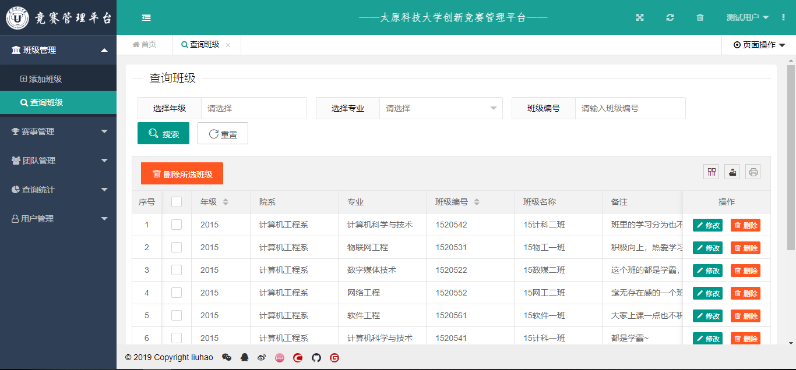
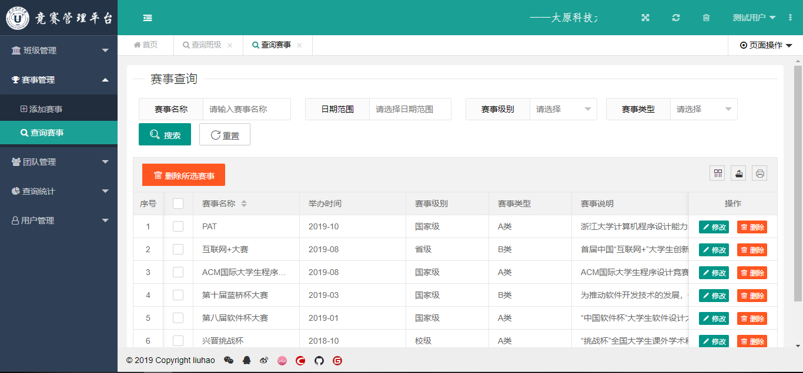
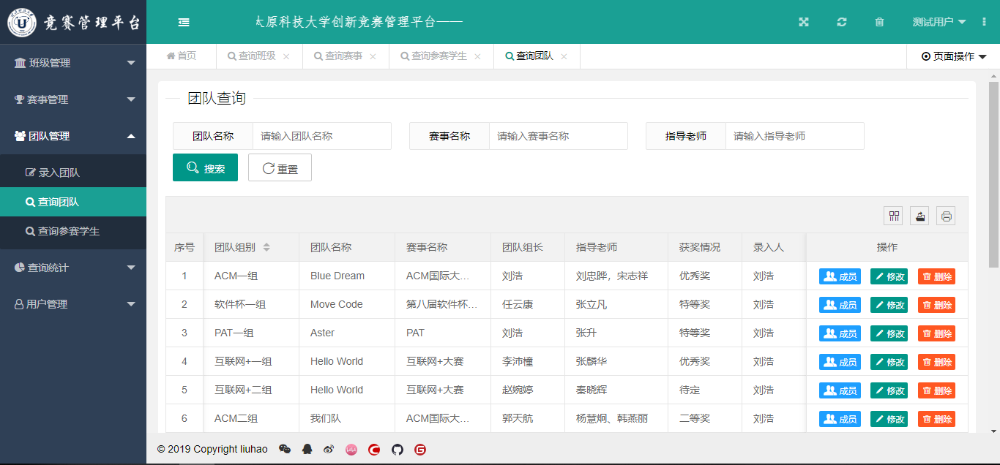

## 项目简介

>项目来源于：[https://gitee.com/fly-liuhao/SCMS](https://gitee.com/fly-liuhao/SCMS)

**原仓库中未上传jar包及登录异常，现将修改过的源码上传到百度网盘上。**

>链接：https://pan.baidu.com/s/1VMsaIla5JgDY-5gYCqifWw 
>提取码：lro4

本系统基于**Layui+Servlet+MyBatis+Mysql**。只使用了企业级ORM框架MyBatis，涉及技术少，非常适合**MyBatis入门者**提升学习使用。

**难度等级：中等**

## 技术栈

### 编辑器

Eclipse Version: 2019-12 (4.14.0)

### 前端技术

基础：html+css+JavaScript

框架：[Layui](https://www.layui.com/)+[JQuery](https://jquery.com/)

### 后端技术

Servlet

ORM框架：MyBatis

数据库：mysql 5.7.27（个人测试使用）

jdk版本：1.8.0_181（个人测试使用）

tomcat版本：8.5.34（个人测试使用）

## 本地运行
### Eclipse环境准备
1.[eclipse新增jdk](../../public/oldPicturesFromGitee/Eclipse%E6%96%B0%E5%A2%9Ejdk.mp4)

2.[eclipse新增tomcat](../../public/oldPicturesFromGitee/Eclipse%E6%96%B0%E5%A2%9Etomcat.mp4)

### 导入项目

> 若有疑惑可查看[视频版本](https://zhuanlan.zhihu.com/p/122402119)。

1.从百度网盘下载源码

2.使用eclipse打开项目，配置jdk、tomcat和所需jar包。

3.打开Navicat For Mysql，新建名称为**scms**的数据库，复制**scms.sql**中的内容到Navicat运行。

4.修改**jdbc.properties**中数据库相关的内容。

5.发布到tomcat中，具体访问链接看tomcat配置，若未修改则[http://localhost:8080/SCMS/](http://localhost:8080/SCMS/)为登录页。

默认账号：admin 默认密码：123456

## 注意
- 该项目未声明mysql、jdk、tomcat使用版本，以上版本号均为个人测试使用版本。
- 注意**修改jdbc.properties中数据库相关的内容。**
- 原仓库中没有上传项目使用jar包且登录存在问题，若无解决能力可从百度网盘下载。

## 项目截图

## 声明
- 该项目收集于gitee，本人只是代为说明使用技术、注意点及启动方式，帮助大家进行学习交流。
- **若通过gitee地址无法下载该项目或无法正常运行，可私信我，本人免费协助。**

#### 推荐阅读
- [JSP+Servlet+JDBC+DBCP2实现在线购书系统](https://mp.weixin.qq.com/s/kFHzkRtL6FNN9koaWAjDkg)
- [JSP+Servlet+JDBC实现的shine网上书城](https://mp.weixin.qq.com/s/GvfywZwg28IMYk5Q2ZWcOw)
- [JSP+Servlet+JDBC实现的云端汽修后台管理系统](https://mp.weixin.qq.com/s/kalGv5T8AZGxTnLHr2wDsA)
- [JSP+Servlet+JDBC实现的学生信息管理系统](https://mp.weixin.qq.com/s/K-H50joCXeE0cnwmtoqhJw)
- [JSP+Servlet+C3P0+Mysql实现的YCU movies电影网站](https://mp.weixin.qq.com/s/bJ1lGNDrVwzXx5z9dDaV-w)
- [JSP+Servlet+C3P0+Mysql实现的图书馆管理系统](https://mp.weixin.qq.com/s/MdGVYX_8t-CiOasghGPrRw)

---

本篇已收录于个人GitHub仓库[https://github.com/coderzcr/JavaWeb-Project-Source-Share](https://github.com/coderzcr/JavaWeb-Project-Source-Share)，欢迎Star。

欢迎关注我的公众号“**张有路**”，原创技术文章第一时间推送。

