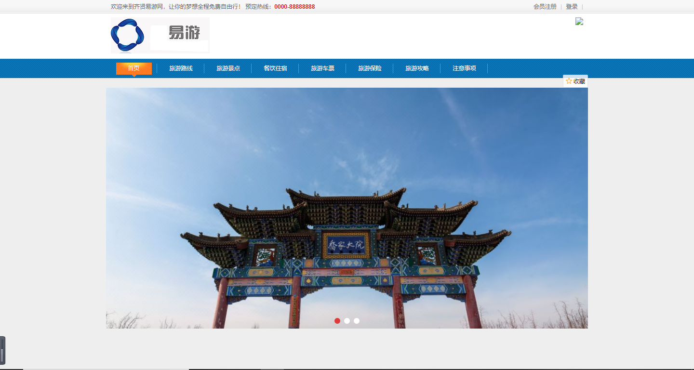
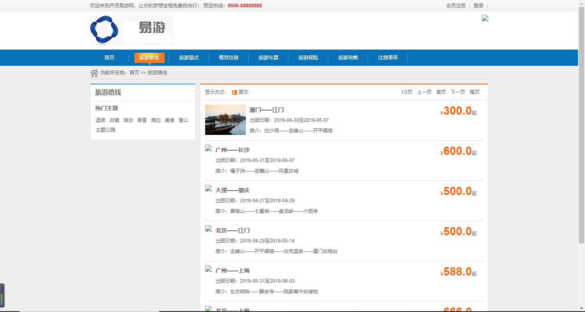
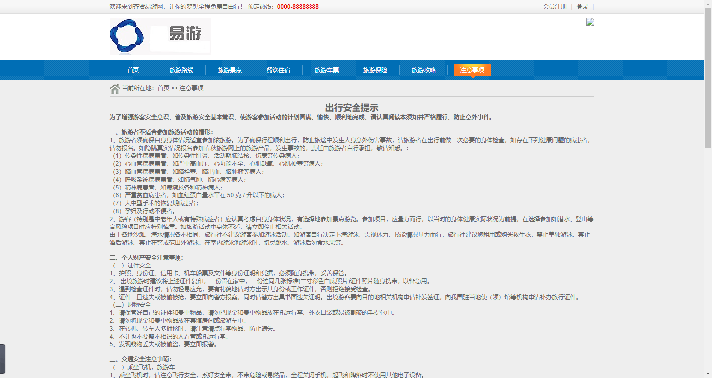
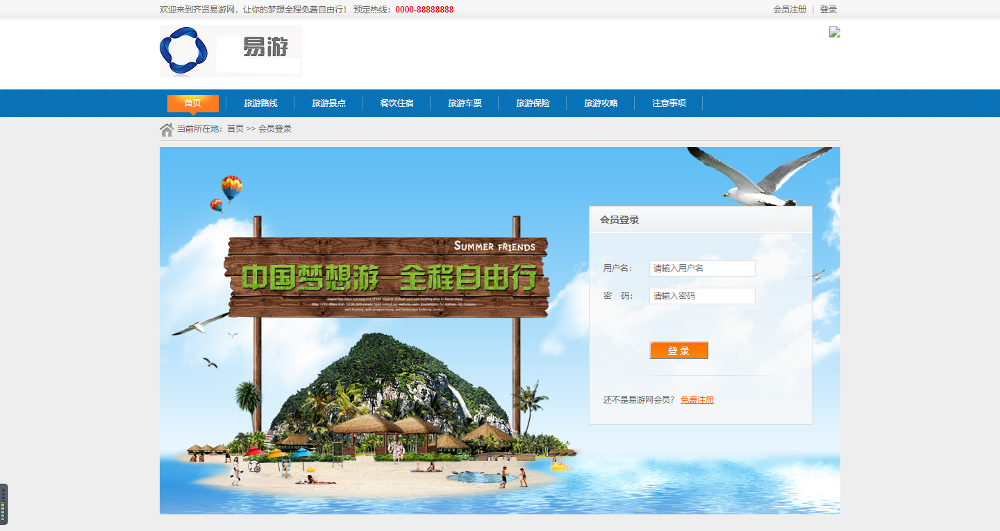
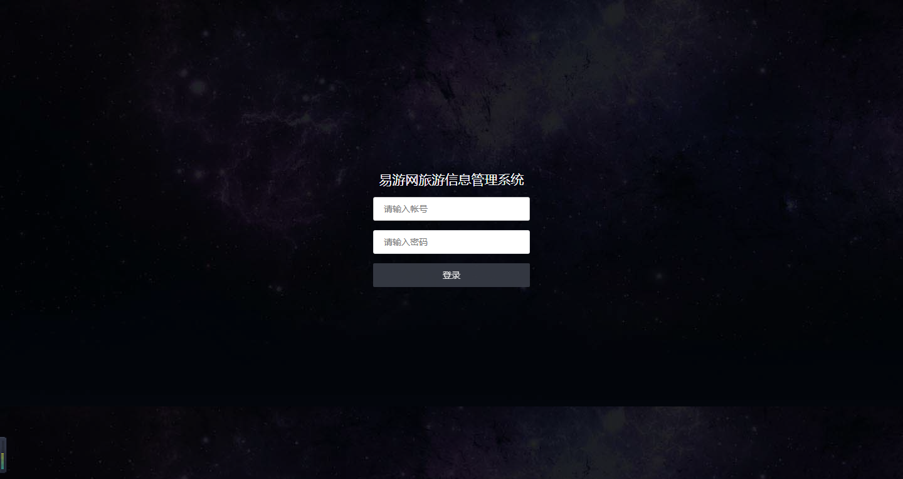
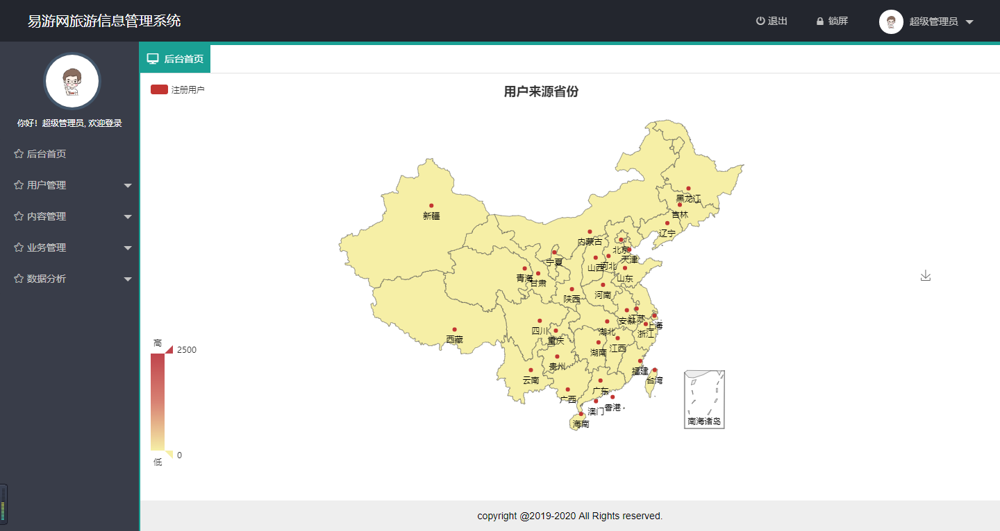
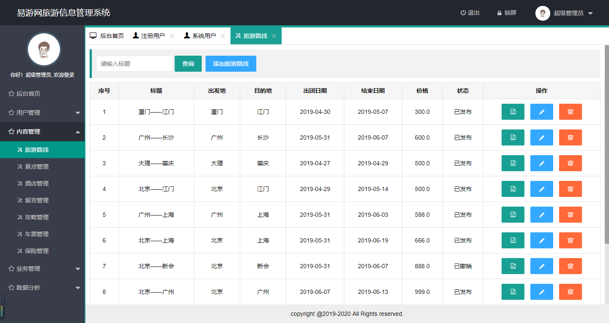

## 项目简介

>项目来源于：[https://github.com/liuyongfei-1998/root](https://github.com/liuyongfei-1998/root)

本系统是基于**Thymeleaf+SpringBoot+Mybatis**。是非常标准的SSM三大框架（
**SpringBoot就是一个大框架，里面包含了许多的东西，其中Spring就是最核心的内容，其中也包含Spring MVC**）实现的齐贤易游网旅游信息管理系统。

**难度等级：中等**

## 技术栈

### 编辑器

IntelliJ IDEA 2019.1.1 (Ultimate Edition)

### 前端技术

基础：html+css+JavaScript

框架：[JQuery](https://www.runoob.com/jquery/jquery-tutorial.html)+[Layui](https://www.layui.com/)

### 后端技术

SpringBoot 1.5.8.RELEASE+Mybatis

模板引擎：thymeleaf

数据库连接池：Tomcat-JDBC（SpringBoot1默认）

数据库：mysql 5.7.27（个人测试使用）

jdk版本：1.8.0_181（个人测试使用）


## 本地运行

> 若有疑惑可查看[视频版本](https://zhuanlan.zhihu.com/p/135932271)。

1.下载zip直接解压或安装git后执行克隆命令 
```
git clone https://github.com/liuyongfei-1998/root.git
```
**若下载过慢可将github仓库复制到gitee上。** [查看视频](../../public/oldPicturesFromGitee/GitHub下载慢怎么办？.mp4)

2.使用idea打开项目，配置maven、jdk即可。

3.打开Navicat For Mysql，创建**travel**数据库，并运行**travel.sql**。

4.修改**application.yml**中数据库相关的内容。

5.运行**com.cn.travel.TravelApplication**
,运行成功后，[http://localhost/index](http://localhost/index)为首页。[http://localhost/login](http://localhost/login)为后台登录。

管理员初始账号：root

管理员初始密码：123456


## 注意
- 该项目未声明mysql、jdk使用版本，以上版本号均为个人测试使用版本。
- 注意**修改application.yml中数据库相关的内容。**


## 项目截图









## 声明
- 该项目收集于gitee，本人只是代为说明使用技术、注意点及启动方式，帮助大家进行学习交流。
- **若通过gitee地址无法下载该项目或无法正常运行，可私信我，本人免费协助。**


#### 推荐阅读
- [JSP+Servlet+JDBC+DBCP2实现在线购书系统](https://mp.weixin.qq.com/s/kFHzkRtL6FNN9koaWAjDkg)
- [JSP+Servlet+JDBC实现的shine网上书城](https://mp.weixin.qq.com/s/GvfywZwg28IMYk5Q2ZWcOw)
- [JSP+Servlet+JDBC实现的云端汽修后台管理系统](https://mp.weixin.qq.com/s/kalGv5T8AZGxTnLHr2wDsA)
- [JSP+Servlet+JDBC实现的学生信息管理系统](https://mp.weixin.qq.com/s/K-H50joCXeE0cnwmtoqhJw)
- [JSP+Servlet+C3P0+Mysql实现的YCU movies电影网站](https://mp.weixin.qq.com/s/bJ1lGNDrVwzXx5z9dDaV-w)
- [JSP+Servlet+C3P0+Mysql实现的图书馆管理系统](https://mp.weixin.qq.com/s/MdGVYX_8t-CiOasghGPrRw)

---

本篇已收录于个人GitHub仓库[https://github.com/coderzcr/JavaWeb-Project-Source-Share](https://github.com/coderzcr/JavaWeb-Project-Source-Share)，欢迎Star。


欢迎关注我的公众号“**张有路**”，原创技术文章第一时间推送。


