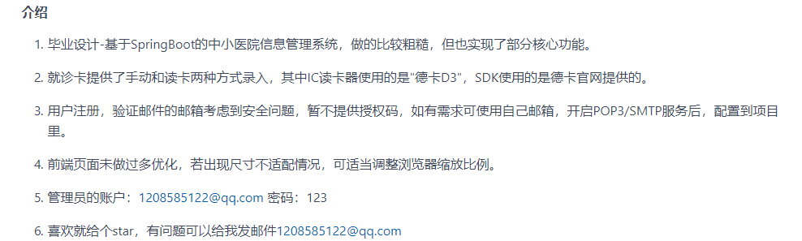
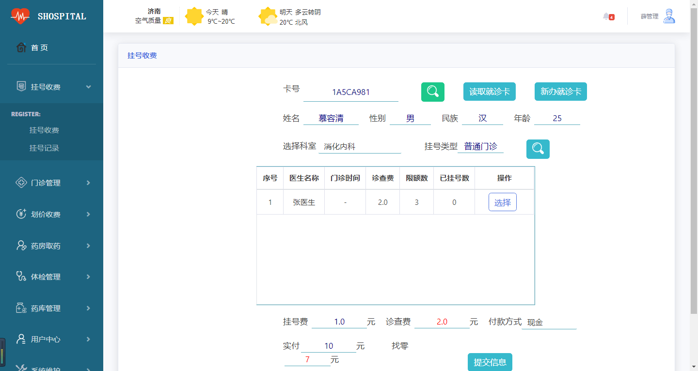
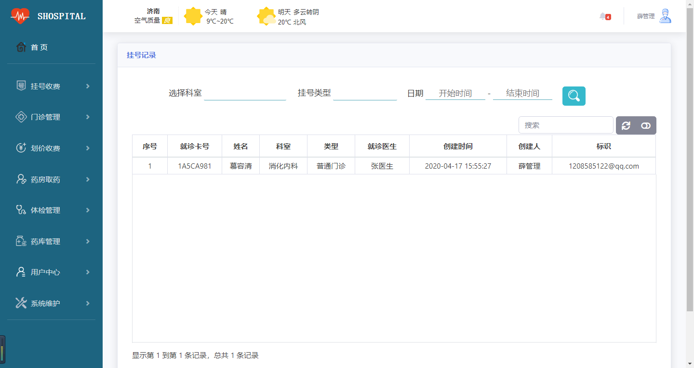
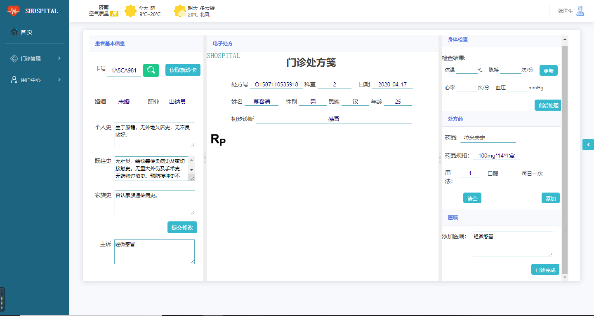
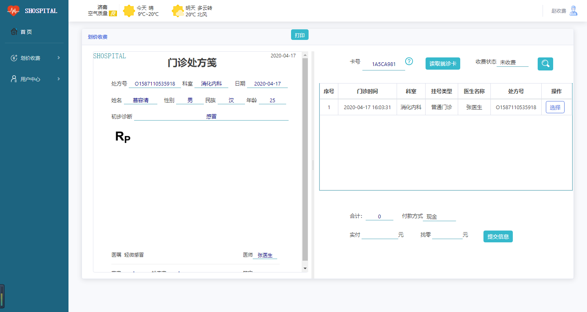
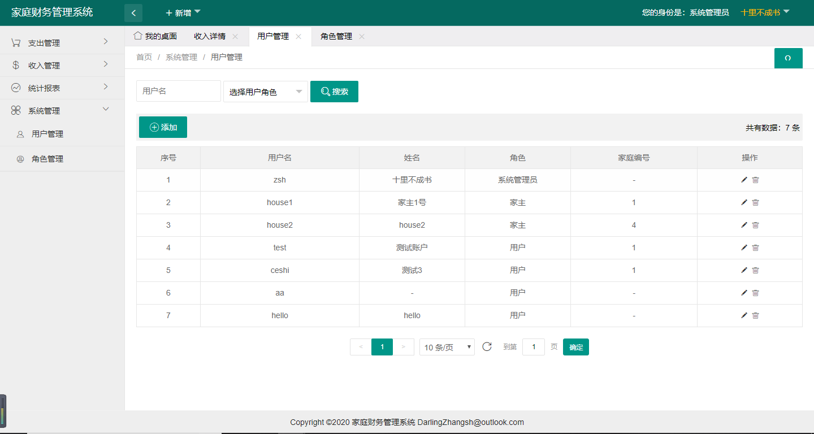

## 项目简介

>项目来源于：[https://gitee.com/sensay/hisystem](https://gitee.com/sensay/hisystem)

**作者介绍**


本系统是基于**Thymeleaf+SpringBoot+SpringDataJPA**实现的的中小医院信息管理系统。简单实现了挂号收费，门诊管理，划价收费，药房取药，体检管理，药房管理，系统维护等基础功能。

**难度等级：中等**

## 技术栈

### 编辑器

IntelliJ IDEA 2019.1.1 (Ultimate Edition)

### 前端技术

基础：html+css+JavaScript

框架：[Bootstrap](https://www.bootcss.com/)+[JQuery](https://www.runoob.com/jquery/jquery-tutorial.html)

### 后端技术

SpringBoot 2.1.1.RELEASE+SpringDataJPA

模板引擎：thymeleaf

权限控制：shiro

数据库连接池：HikariCP（SpringBoot默认）

接口文档生成：swagger2

IC读卡器：德卡D3 SDK

数据库：mysql 5.7.27（个人测试使用）

jdk版本：1.8.0_181（个人测试使用）


## 本地运行

> 若有疑惑可查看[视频版本](https://zhuanlan.zhihu.com/p/132590561)。

1.下载zip直接解压或安装git后执行克隆命令 
```
git clone https://gitee.com/sensay/hisystem.git
```
2.使用idea打开项目，配置maven、jdk即可。

3.打开Navicat For Mysql，创建**hisystem**数据库，并运行**sql/hisystem.sql**。

4.修改**application.yml**中数据库相关的内容。

5.运行**com.xgs.hisystem.HisystemApplication**,运行成功后，[http://localhost:8090](http://localhost:8090)为登录页面。

系统管理员初始账号：1208585122@qq.com（作者qq）

系统管理员初始密码：123


## 注意
- 该项目未声明mysql、jdk使用版本，以上版本号均为个人测试使用版本。
- 注意**修改application.yml中数据库相关的内容。**


## 项目截图







## 声明
- 该项目收集于gitee，本人只是代为说明使用技术、注意点及启动方式，帮助大家进行学习交流。
- **若通过gitee地址无法下载该项目或无法正常运行，可私信我，本人免费协助。**


#### 推荐阅读
- [JSP+Servlet+JDBC+DBCP2实现在线购书系统](https://mp.weixin.qq.com/s/kFHzkRtL6FNN9koaWAjDkg)
- [JSP+Servlet+JDBC实现的shine网上书城](https://mp.weixin.qq.com/s/GvfywZwg28IMYk5Q2ZWcOw)
- [JSP+Servlet+JDBC实现的云端汽修后台管理系统](https://mp.weixin.qq.com/s/kalGv5T8AZGxTnLHr2wDsA)
- [JSP+Servlet+JDBC实现的学生信息管理系统](https://mp.weixin.qq.com/s/K-H50joCXeE0cnwmtoqhJw)
- [JSP+Servlet+C3P0+Mysql实现的YCU movies电影网站](https://mp.weixin.qq.com/s/bJ1lGNDrVwzXx5z9dDaV-w)
- [JSP+Servlet+C3P0+Mysql实现的图书馆管理系统](https://mp.weixin.qq.com/s/MdGVYX_8t-CiOasghGPrRw)

---

本篇已收录于个人GitHub仓库[https://github.com/coderzcr/JavaWeb-Project-Source-Share](https://github.com/coderzcr/JavaWeb-Project-Source-Share)，欢迎Star。


欢迎关注我的公众号“**张有路**”，原创技术文章第一时间推送。


