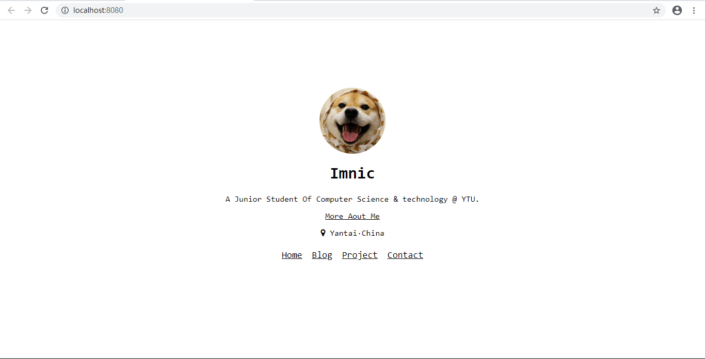
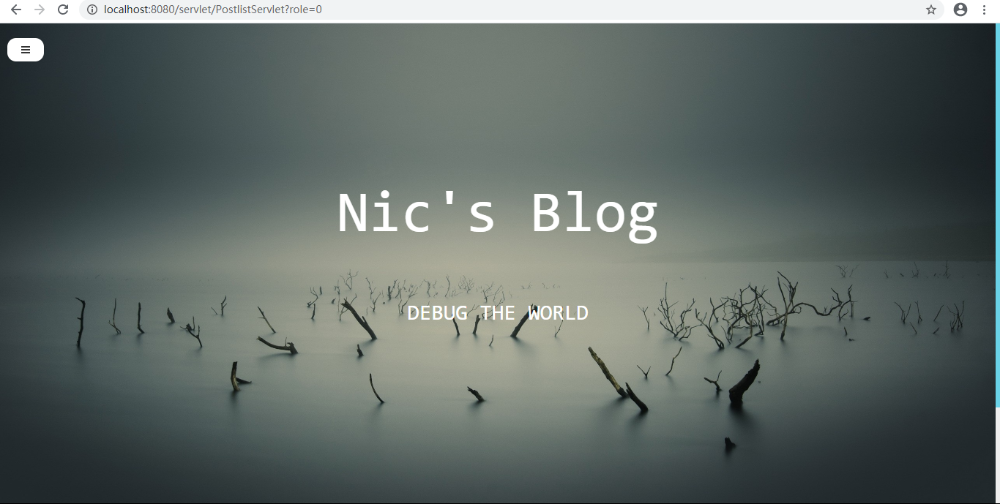
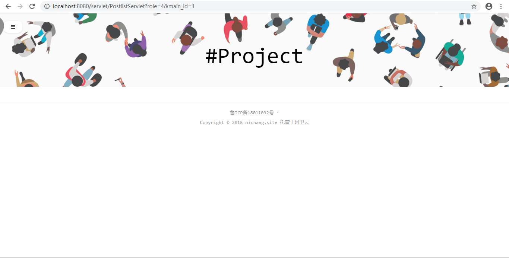
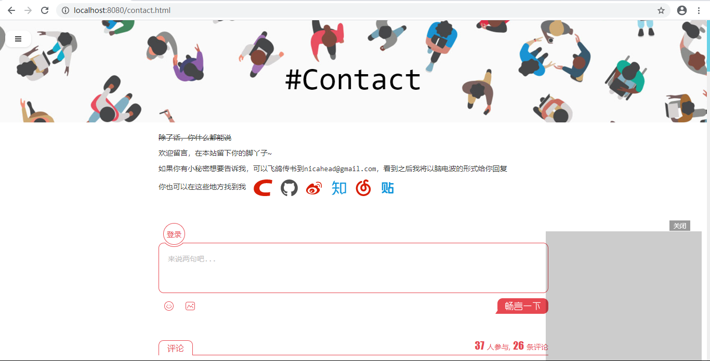
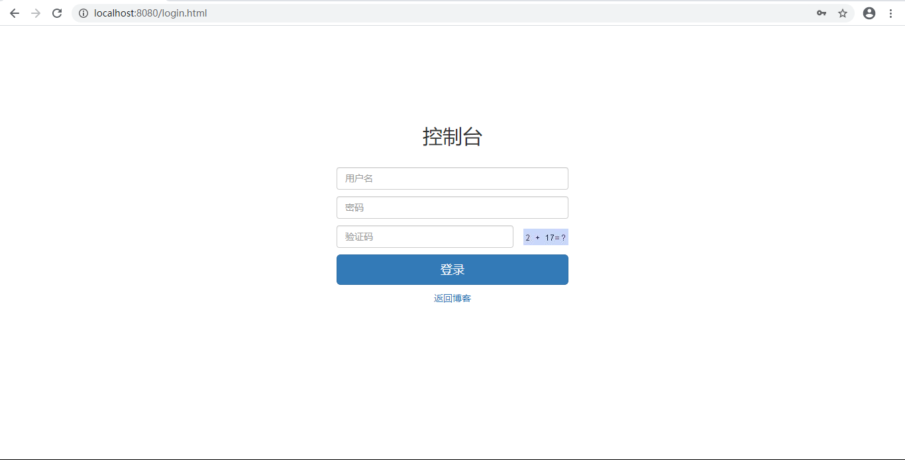
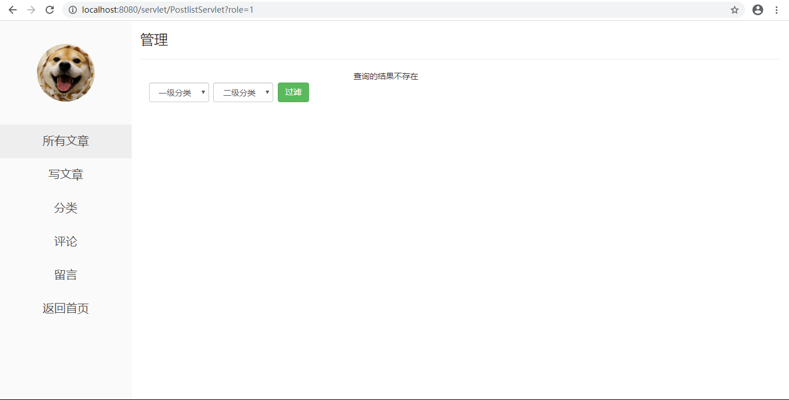

>  **本文存在[视频版本](https://zhuanlan.zhihu.com/p/116750137),请知悉**

----------

## 项目简介

>项目来源于：[https://gitee.com/nanpingping/jsp-blog](https://gitee.com/nanpingping/jsp-blog)

这次分享个人博客系统，界面简洁大气，功能齐全，是不可多得的比较容易的系统，非常适合毕业设计或者课程设计。

本系统基于**JSP+Servlet+JDBC+Mysql**。涉及技术少，易于理解，适合**JavaWeb初学者**学习使用。

**难度等级：新手**

## 技术栈
### 编辑器

IntelliJ IDEA 2019.1.1 (Ultimate Edition)

### 前端技术
基础：html+css+JavaScript

框架：[BootStrap](https://www.bootcss.com/)+[JQuery](https://jquery.com/)

### 后端技术
Jsp+Servlet

数据库：mysql 5.7.27（个人测试使用）

jdk版本：1.8.0_181（个人测试使用）

tomcat版本：8.5.34（个人测试使用）

## 本地运行

1.下载zip直接解压或安装git后执行克隆命令 
```
https://gitee.com/nanpingping/jsp-blog.git
```
2.使用Idea打开项目，配置jdk、tomcat和所需jar包。
项目所依赖jar包在**web/WEB-INF/lib**文件夹下。

3.打开Navicat For Mysql，创建blog数据库，复制**blog.sql**中的文件内容运行。

4.修改**jdbc.properties**中数据库相关的内容。

5.发布到tomcat中，具体访问链接看tomcat配置，若未修改则[http://localhost:8080/](http://localhost:8080/)为首页。
[http://localhost:8080/login.html](http://localhost:8080/login.html)为控制台页面。
系统中不存在初始账号，可以**在user表中新增一个用户**即可。


## 注意
- 该项目未声明mysql、jdk、tomcat使用版本，以上版本号均为个人测试使用版本。
- 注意**修改jdbc.properties中数据库相关的内容。**
- 系统中不存在初始账号，可以**在user表中新增一个用户**即可。


## 项目截图







## 声明
- 该项目收集于gitee，本人只是代为说明使用技术、注意点及启动方式，帮助大家进行学习交流。

- **若通过gitee地址无法下载该项目或无法正常运行，可私信我，本人免费协助。**


#### 推荐阅读
- [JSP+Servlet+JDBC+DBCP2实现在线购书系统](https://mp.weixin.qq.com/s/kFHzkRtL6FNN9koaWAjDkg)
- [JSP+Servlet+JDBC实现的shine网上书城](https://mp.weixin.qq.com/s/GvfywZwg28IMYk5Q2ZWcOw)
- [JSP+Servlet+JDBC实现的云端汽修后台管理系统](https://mp.weixin.qq.com/s/kalGv5T8AZGxTnLHr2wDsA)
- [JSP+Servlet+JDBC实现的学生信息管理系统](https://mp.weixin.qq.com/s/K-H50joCXeE0cnwmtoqhJw)

---

欢迎关注我的公众号“**张有路**”，原创技术文章第一时间推送。


