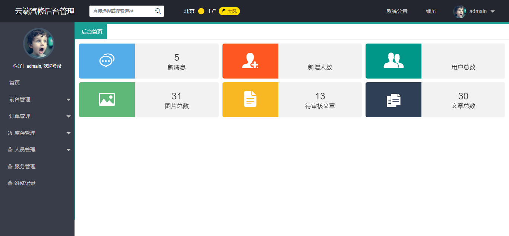
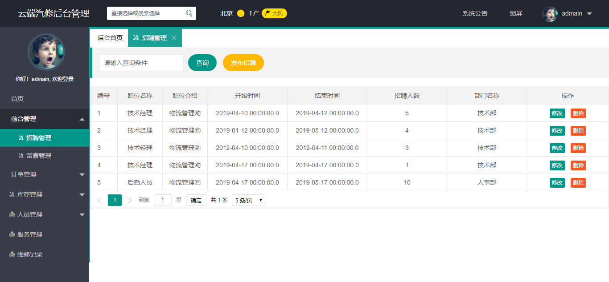
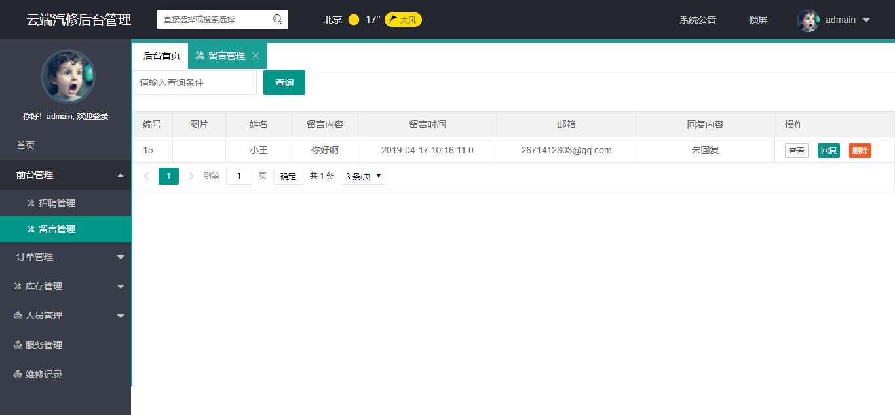
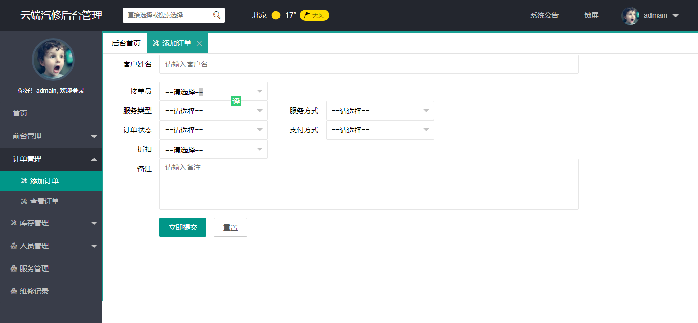
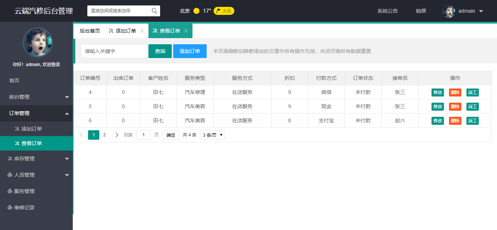

>  **本文存在[视频版本][1],请知悉**


----------
## 项目简介
>项目来源于：[https://gitee.com/chenlinSir/CloudDemo-servlet](https://gitee.com/chenlinSir/CloudDemo-servlet)

**难度等级：新手**

基于**JSP+Servlet+Jdbc**的云端汽修后台管理系统。涉及技术少，易于理解，适合**JavaWeb初学者**学习使用。


## 技术栈

### 编辑器
Eclipse Version: 2019-12 (4.14.0)
### 前端技术
基础：html+css+JavaScript

框架：[JQuery](https://jquery.com/)+[layui](https://www.layui.com/)
### 后端技术

Jsp+Servlet

数据库：mysql 5.7.27（个人测试使用）

jdk版本：1.8.0_181（个人测试使用）

tomcat版本：8.5.34（个人测试使用）
## 本地运行
### Eclipse环境准备
1.[eclipse新增jdk](../../public/oldPicturesFromGitee/Eclipse%E6%96%B0%E5%A2%9Ejdk.mp4)

2.[eclipse新增tomcat](../../public/oldPicturesFromGitee/Eclipse%E6%96%B0%E5%A2%9Etomcat.mp4)
### 导入项目
1. 下载zip直接解压或安装git后执行克隆命令 
```
git clone https://gitee.com/chenlinSir/CloudDemo-servlet.git
```
2. 使用eclipse打开项目，配置jdk、tomcat和所需jar包。
项目所依赖jar包在WebContent/WEB-INF/lib文件夹下。
3. 复制CloudDermos.sql文件内容，并粘贴到Navicat中运行。
4. 修改com.cloud.util.Conn类中数据库相关的内容。
5. 发布到tomcat中，[http://localhost:8080/CloudDermos](http://localhost:8080/CloudDermos)为首页。

初始账号：admain 初始密码：123456

## 注意
- 该项目未声明mysql、jdk、tomcat使用版本，以上版本号均为个人测试使用版本
- 注意**修改com.cloud.util.Conn类中数据库相关的内容**


## 项目截图







## 声明
- 该项目收集于gitee，本人只是代为说明使用技术、注意点及启动方式，帮助大家进行学习交流。
- **若通过gitee地址无法下载该项目或无法正常运行，可私信我，本人免费协助。**

#### 推荐阅读
- [项目分享JSP+Servlet+JDBC+DBCP2实现在线购书系统](https://mp.weixin.qq.com/s/kFHzkRtL6FNN9koaWAjDkg)
- [项目分享JSP+Servlet+JDBC实现的shine网上书城](https://mp.weixin.qq.com/s/GvfywZwg28IMYk5Q2ZWcOw)
- [最全Redis基础知识](https://mp.weixin.qq.com/s/AxvoxLBqKtq3dCPU4FqHbw)


---

欢迎关注我的公众号“**张有路**”，原创技术文章第一时间推送。


  [1]: https://zhuanlan.zhihu.com/p/114188772