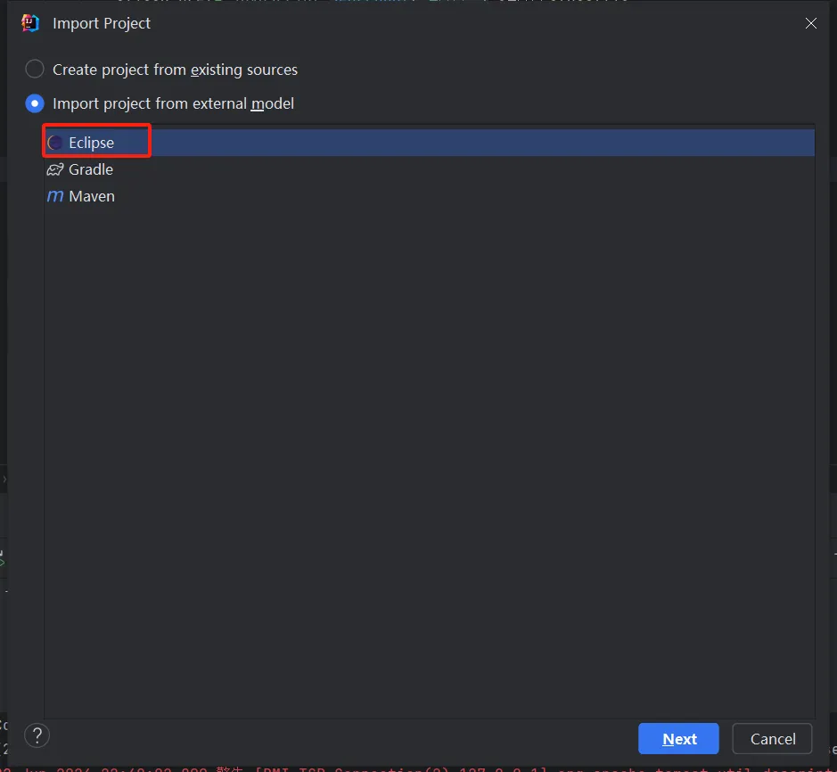
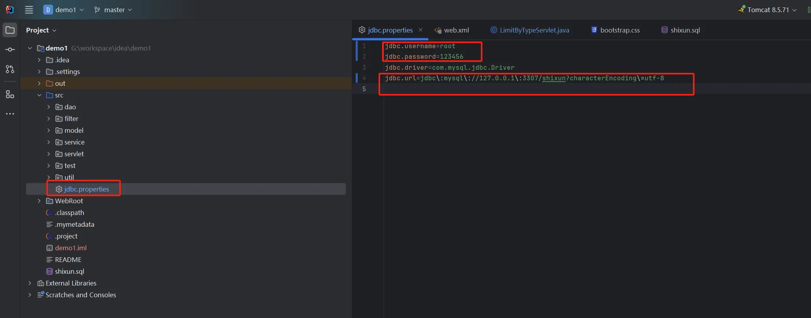
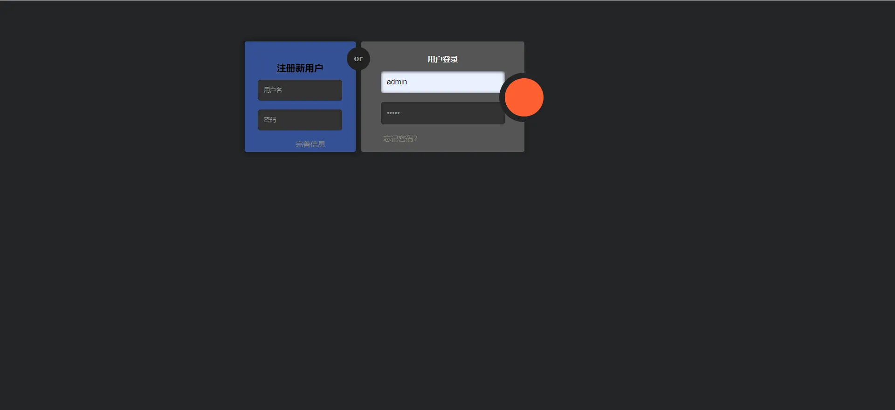
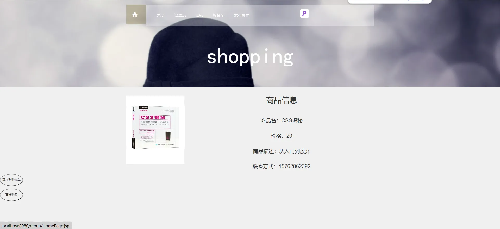
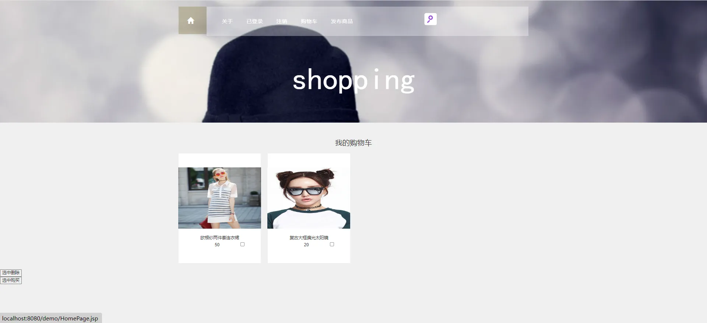

# JSP+Servlet+Mysql实现的二手交易网站

## 引言

大家好，今天我想和大家分享一个适合新手入门的二手交易网站源码。这个项目不仅能帮助你熟悉Java Web开发的基本知识，还能通过实际操作提升你的编程技能。我们将一步步介绍如何搭建开发环境、了解核心功能模块、掌握前后端技术栈，最后还会展示一些常见问题及解决方案。

## 开发环境准备

在开始之前，我们需要准备好以下开发环境：

- **MySQL 5.7**：用于存储和管理我们的数据。MySQL是一个关系型数据库管理系统，它能处理大量的数据存储和查询。安装MySQL后，我们可以创建数据库和表来存储用户信息、商品信息等。

- **JDK 8**：Java开发工具包，提供了运行Java程序所需的环境。JDK 8是一个稳定的版本，支持许多现代Java特性。安装JDK 8后，我们可以编写和运行Java代码。

- **Tomcat 8.5**：一个开源的Web服务器，用于运行我们的Web应用。Tomcat能够处理大量的并发请求，是许多Java Web应用的首选服务器。安装Tomcat后，我们可以将Web应用部署到Tomcat上进行测试。

- **IntelliJ IDEA**：IDEA是一个功能强大的集成开发环境，支持Java开发。下载并安装IntelliJ IDEA后，我们可以方便地进行项目管理、代码编写、调试和部署。

## 核心功能模块

在这个二手交易网站中，我们实现了以下核心功能：

- **用户管理**：包括用户的登录、注销和注册功能。注册过程中还包含验证码验证，确保用户的真实性。

- **购物车功能**：用户可以将商品加入购物车，并支持批量删除和批量购买功能，方便用户管理购物车中的商品。

- **商品管理**：用户可以发布商品，并对商品按人气和价格进行排序。我们还实现了分页和分类查看商品的功能，用户可以根据自己的需求浏览商品。

- **搜索功能**：实现了一个可隐藏的搜索框，用户可以在首页通过关键词搜索商品。同时，首页还实现了图片滚动展示，提升用户体验。

## 前后端技术栈

### 前端技术栈

- **HTML**：用于构建网页的基本结构。
- **CSS**：用于美化网页，使其更加美观和用户友好。
- **JavaScript**：用于实现网页的动态效果和交互功能。
- **JQuery**：一个快速、简洁的JavaScript框架，简化了HTML文档遍历、事件处理、动画和Ajax交互。
- **Bootstrap.css**：一个开源的前端框架，提供了丰富的UI组件和样式，帮助我们快速构建响应式网页。

### 后端技术栈

- **Servlet**：用于处理客户端的请求和响应。Servlet是Java Web开发的核心技术，可以处理HTTP请求和生成HTTP响应。

- **JSP**：Java Server Pages，用于动态生成HTML内容。JSP可以嵌入Java代码，使我们能够在网页中动态生成内容。

- **JDBC**：Java数据库连接，用于连接和操作数据库。JDBC提供了一组API，可以让我们方便地操作数据库。

- **Tomcat**：一个开源的Web服务器，用于部署和运行我们的Web应用。Tomcat能够处理大量的并发请求，是许多Java Web应用的首选服务器。

## 常见问题及解决方案

在开发和运行这个二手交易网站的过程中，我们可能会遇到一些常见问题。以下是几个常见问题及其解决方案：

- **数据库连接失败**：检查数据库配置是否正确，确保MySQL服务已启动，并且用户名和密码正确。
- **Tomcat无法启动**：检查Tomcat配置是否正确，确保端口未被占用，并查看Tomcat日志获取详细错误信息。
- **购物车购买逻辑不全**：需要有基础能够修改代码。
## 源码下载和运行

你可以通过以下链接下载这个二手交易网站的源码。下载后，按照以下步骤运行项目：

为了方便大家使用和学习，本系统的源码已经开源。可以通过以下步骤下载和运行源码：

1. **下载源码**：访问https://github.com/zhouliang58/demo1下载源码。

PS:若上述地址无法访问，访问[https://github.com/coderzcr/JavaWeb-Project-Source-Share/blob/master/newcomer/preview/NEW202007012223.md](https://github.com/coderzcr/JavaWeb-Project-Source-Share/blob/master/newcomer/preview/NEW202007012223.md)。通过百度网盘下载源码。

2. **导入项目**：将源码导入到IDEA中。例如，打开IDEA，选择“File” -> “New” -> “Project from Existing Sources”，然后选择下载的源码目录 -> “Import project from external model”  -> "Eclipse",之后一直Next即可。

3. **数据库创建**： 执行`shixun.sql`文件。

4. **配置环境**：根据开发环境准备部分的要求，配置Tomcat、JDK和在IDEA中，选择“File” -> “Project Structure” -> “Project”，然后设置JDK和Tomcat。

5. **数据库配置修改**：将`src\jdbc.properties`配置文件修改为自己的数据库。

6. **部署项目**：将项目部署到Tomcat服务器上。在IDEA中，选择“Run” -> “Edit Configurations”，然后添加一个新的Tomcat Server配置，选择项目的Web模块。
7. **运行项目**：启动Tomcat服务器，访问系统登录页面。在IDEA中，点击“Run”按钮，启动Tomcat服务器，然后在浏览器中访问`http://localhost:8080/demo`。
## 账号密码

管理员账号：
- 账号：admin
- 密码：admin

## 界面展示

下面是一些项目界面的截图展示：
1. **登录**: 用户输入用户名和密码进行登录。

2. **首页**：展示热门商品和最新发布的商品。

3. **商品详情页**：显示商品的详细信息，包括图片、价格和描述。

4. **购物车页**：用户可以查看和管理购物车中的商品。

## 总结

这个二手交易网站源码是一个非常适合新手入门的项目。通过这个项目，你可以学习到Java Web开发的基本知识，掌握前后端技术栈的使用，并且能够独立搭建一个完整的Web应用。希望你在学习和实践的过程中，能够收获满满。如果有任何问题或建议，欢迎留言讨论。

## 总结

托马斯网上零食商城是一个非常适合新手学习和实践的项目。通过这个项目，你可以了解电商平台的基本功能和开发流程，掌握前后端技术的使用。希望这个项目能对你有所帮助。如果你有任何问题或建议，欢迎留言讨论。Happy coding!

## 声明
- 该项目收集于github，本人只是代为说明使用技术、注意点及启动方式，帮助大家进行学习交流。
- **若通过地址无法下载该项目或无法正常运行，可私信我，本人免费协助。**

--- 

欢迎关注我的公众号“**张有路**”，原创技术文章第一时间推送。

