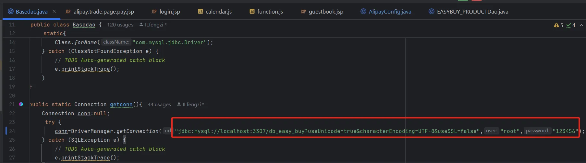
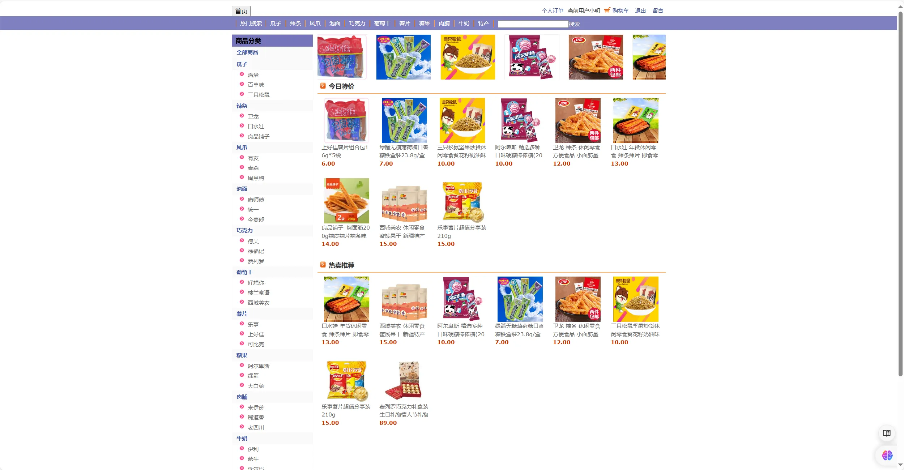
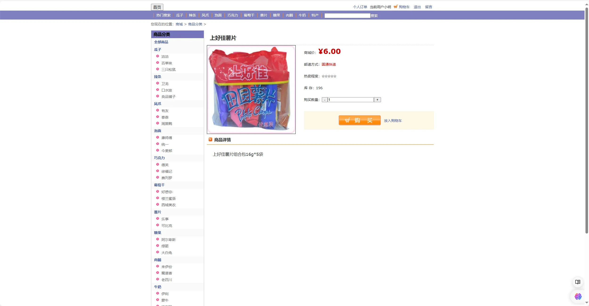
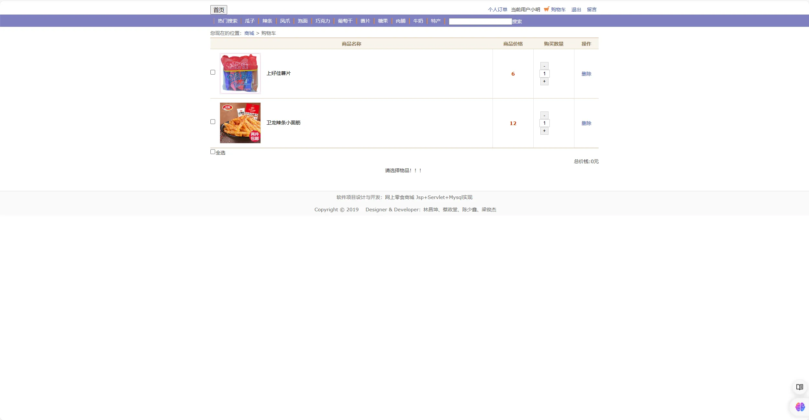
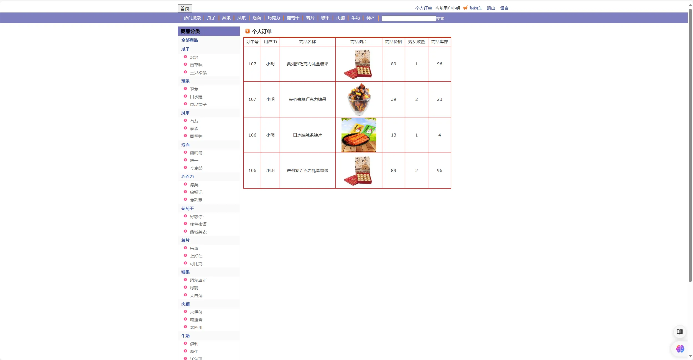

# JSP+Servlet+Mysql实现的托马斯网上零食商城

## 引言

大家好！今天我要分享一个非常适合新手学习和实践的项目：托马斯网上零食商城。这个项目的源代码不仅简单易懂，而且涵盖了电商平台的基本功能。无论你是刚开始学习编程，还是想要了解电商平台的开发流程，这个项目都非常适合你。

**「难度等级：新手」**
## 项目来源

> [https://github.com/ILfengzi/TMSshopping](https://github.com/ILfengzi/TMSshopping)

## 开发环境准备

在开始之前，我们需要准备好开发环境。以下是这个项目所需的工具和版本：

- **MySQL 5.7**：用于存储和管理我们的数据。MySQL是一个关系型数据库管理系统，能够处理大量的数据存储和查询。
- **JDK 8**：Java开发工具包，提供了运行Java程序所需的环境。JDK 8是一个稳定的版本，支持许多现代Java特性。
- **Tomcat 8.5**：一个开源的Web服务器，用于运行我们的Web应用。Tomcat能够处理大量的并发请求，是许多Java Web应用的首选服务器。
- **IntelliJ IDEA**：IDEA是一个功能强大的集成开发环境，支持Java开发。下载并安装IntelliJ IDEA后，可以方便地进行项目管理、代码编写、调试和部署。

确保你的电脑已经安装了以上工具，并且版本符合要求。

## 核心功能模块

托马斯网上零食商城主要分为买家和管理员两大角色，每个角色都有各自的功能模块。

### 买家功能

1. **注册**：用户可以通过注册成为商城的会员。
2. **登录**：注册后的用户可以通过登录进入商城。
3. **商品选购**：用户可以浏览和选购商品。
4. **加入购物车**：选购的商品可以加入购物车，方便结算。
5. **支付下单**：用户可以通过支付完成订单。
6. **查看订单**：用户可以查看自己的订单详情。
7. **给卖家留言**：用户可以给卖家留言，提出问题或建议。
8. **热卖推荐**：系统会推荐热卖商品给用户。

### 管理员功能

1. **登录**：管理员通过登录进入后台管理系统。
2. **账号管理**：管理员可以管理用户账号。
3. **商品分类**：管理员可以对商品进行分类管理。
4. **商品管理**：管理员可以添加、修改、删除商品。
5. **订单管理**：管理员可以查看和管理用户订单。
6. **回复留言**：管理员可以回复用户的留言。

## 前后端技术栈

### 前端技术栈

- **HTML**：用于构建网页的结构。HTML是网页的基础语言，所有的网页元素都是通过HTML标签来定义的。
- **CSS**：用于美化网页的样式。CSS可以控制网页的布局、颜色、字体等，使网页更加美观和用户友好。
- **JavaScript**：用于实现网页的交互功能。JavaScript是一种脚本语言，可以在网页中实现动态效果和用户交互。

### 后端技术栈

- **Servlet**：用于处理客户端的请求和响应。Servlet是Java Web开发的核心技术，可以处理HTTP请求和生成HTTP响应。
- **JSP**：Java Server Pages，用于动态生成HTML内容。JSP可以嵌入Java代码，使我们能够在网页中动态生成内容。
- **JDBC**：Java数据库连接，用于连接和操作数据库。JDBC提供了一组API，可以让我们方便地操作数据库。
- **Tomcat**：一个开源的Web服务器，用于部署和运行我们的Web应用。Tomcat能够处理大量的并发请求，是许多Java Web应用的首选服务器。

## 常见问题及解决方案

在开发和运行这个项目的过程中，你可能会遇到一些常见问题。以下是一些常见问题及其解决方案：

1. **数据库连接失败**：检查MySQL服务是否启动，数据库配置是否正确。
2. **页面加载缓慢**：优化前端代码，减少不必要的请求。
3. **支付功能无法使用**：检查支付接口配置是否正确，支付服务是否正常运行。
4. **订单无法生成**：检查后端代码逻辑，确保订单生成流程正确。

## 源码下载和运行

为了方便大家使用和学习，本系统的源码已经开源。可以通过以下步骤下载和运行源码：

1. **下载源码**：访问https://github.com/ILfengzi/TMSshopping下载源码。

PS:若上述地址无法访问，访问[https://github.com/coderzcr/JavaWeb-Project-Source-Share/blob/master/newcomer/preview/NEW202006281642.md](https://github.com/coderzcr/JavaWeb-Project-Source-Share/blob/master/newcomer/preview/NEW202007012128.md)。通过百度网盘下载源码。

2. **导入项目**：将源码导入到IDEA中。例如，打开IDEA，选择“File” -> “New” -> “Project from Existing Sources”，然后选择下载的源码目录 -> “Import project from external model”  -> "Eclipse",之后一直Next即可。

3. **数据库创建**： 创建`db_easy_buy`数据库，并执行`db_easy_buy.sql`文件。

4. **配置环境**：根据开发环境准备部分的要求，配置Tomcat、JDK和在IDEA中，选择“File” -> “Project Structure” -> “Project”，然后设置JDK和Tomcat。

5. **数据库配置修改**：将`src/com/dao/Basedao.java`配置文件修改为自己的数据库。

6. **部署项目**：将项目部署到Tomcat服务器上。在IDEA中，选择“Run” -> “Edit Configurations”，然后添加一个新的Tomcat Server配置，选择项目的Web模块。
7. **运行项目**：启动Tomcat服务器，访问系统登录页面。在IDEA中，点击“Run”按钮，启动Tomcat服务器，然后在浏览器中访问`http://localhost:8080/TMSshopping`。

## 账号密码
管理员账号：
- 账号：admin
- 密码：123

买家账号：
- 账号：小明
- 密码：123

## 界面展示

以下是托马斯网上零食商城的一些界面截图：

## 总结

托马斯网上零食商城是一个非常适合新手学习和实践的项目。通过这个项目，你可以了解电商平台的基本功能和开发流程，掌握前后端技术的使用。希望这个项目能对你有所帮助。如果你有任何问题或建议，欢迎留言讨论。Happy coding!

## 声明
- 该项目收集于github，本人只是代为说明使用技术、注意点及启动方式，帮助大家进行学习交流。
- **若通过地址无法下载该项目或无法正常运行，可私信我，本人免费协助。**

--- 

欢迎关注我的公众号“**张有路**”，原创技术文章第一时间推送。

