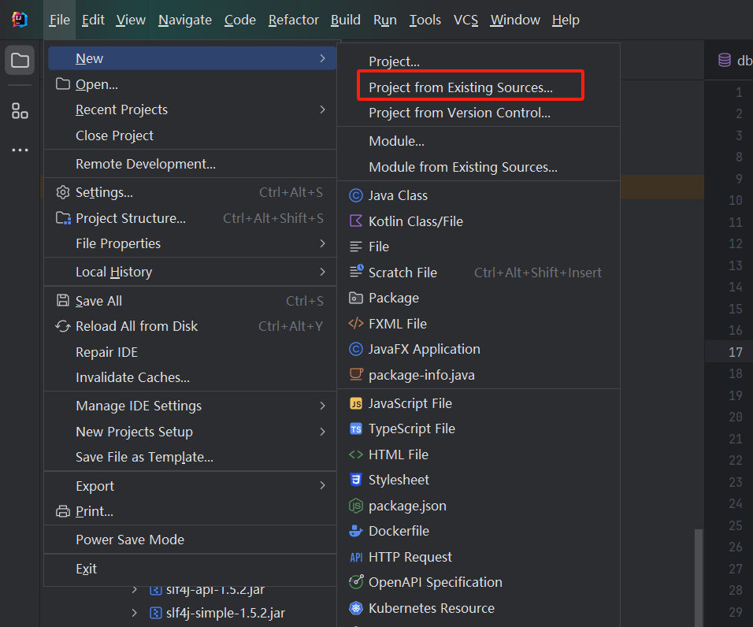
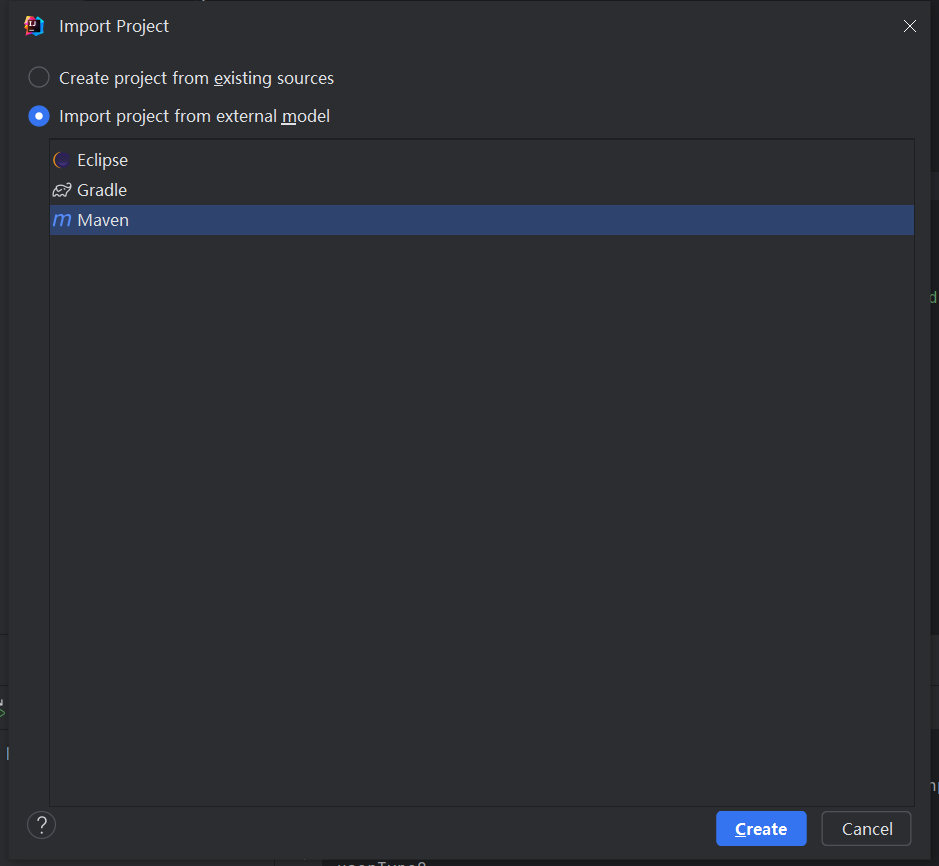
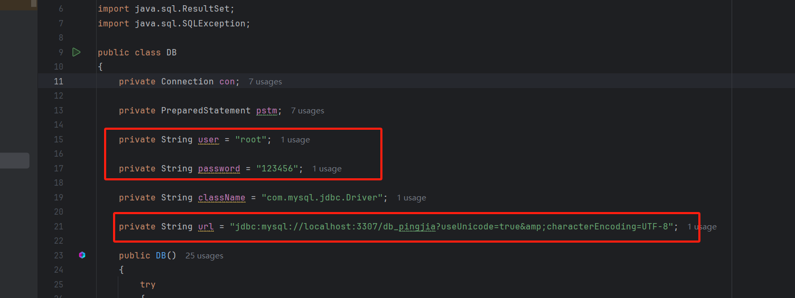
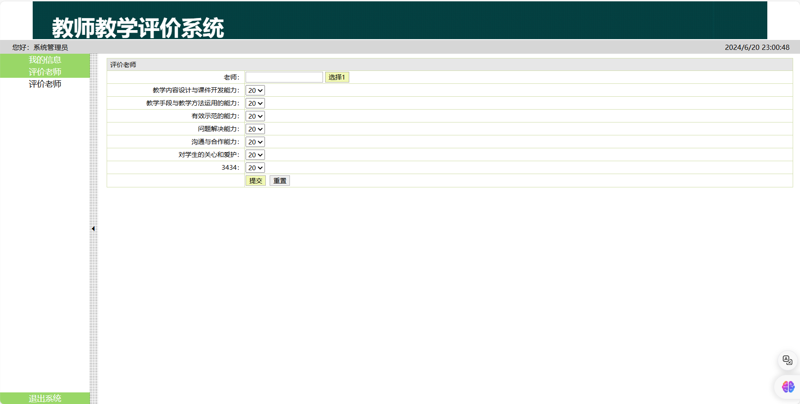

# JSP+Servlet+Mysql实现的教师教学评价系统

教师教学评价系统是一个帮助学校和教育机构对教师进行评价和管理的工具。

通过这个系统，管理员可以管理教师和学生信息，学生可以对教师进行评价。

本文将详细介绍该系统的开发环境、核心功能模块、前后端技术栈、常见问题及解决方案、源码下载和运行以及界面展示。

**「难度等级：新手」**
## 项目来源

> 读者coderyang分享

## 开发环境准备

在开始开发之前，需要准备好以下环境：

- **Tomcat 8.5**：Tomcat是一个开源的Web服务器和Servlet容器，用于运行Java Servlets和JSP。
- **JDK 8**：Java开发工具包，用于编写和运行Java程序。
- **MySQL 5.7**：关系型数据库管理系统，用于存储系统中的数据。
- **IntelliJ IDEA**：IDEA是一个功能强大的集成开发环境，支持Java开发。下载并安装IntelliJ IDEA后，可以方便地进行项目管理、代码编写、调试和部署。

确保所有环境都已正确安装和配置，以便顺利进行开发工作。

## 核心功能模块

系统的核心功能模块包括登录、退出登录、管理员身份和学生身份。每个模块都有其特定的功能和用途。

### 登录

系统提供登录功能，用户可以通过输入用户名和密码进行登录。登录后系统会区分用户是管理员还是学生，并展示相应的功能模块。

### 退出登录

用户可以随时退出登录，系统会清除用户的会话信息，确保安全性。

### 管理员身份

管理员登录后可以进行以下操作：

- **管理员管理**：添加、删除和修改管理员信息。
- **修改密码**：管理员可以修改自己的登录密码。
- **老师管理**：添加、删除和修改教师信息。
- **学生管理**：添加、删除和修改学生信息。
- **评价指标管理**：设置和管理评价教师的指标。
- **评价结果**：查看学生对教师的评价结果。

### 学生身份

学生登录后可以进行以下操作：

- **个人信息**：查看和修改个人信息。
- **评价老师**：根据评价指标对教师进行评价。

## 前后端技术栈

### 前端技术栈

- **HTML**：用于构建网页的结构。HTML（超文本标记语言）是网页的基础，通过标签来定义网页的各个部分，如标题、段落、图片等。
- **CSS**：用于美化网页的样式。CSS（层叠样式表）可以控制网页的颜色、字体、布局等，使网页更加美观和用户友好。
- **JavaScript**：用于实现网页的交互功能。JavaScript是一种脚本语言，可以在网页中实现动态效果，如表单验证、动画效果等。

### 后端技术栈

- **Servlet**：用于处理客户端请求和响应。Servlet是Java EE中的一个组件，可以生成动态网页内容，处理表单数据，管理会话等。
- **JSP**：Java Server Pages，用于生成动态网页内容。JSP是一种基于Java的技术，可以在HTML中嵌入Java代码，实现动态内容生成。
- **JDBC**：Java Database Connectivity，用于连接和操作数据库。JDBC是Java中的一个API，可以通过SQL语句对数据库进行操作，如查询、插入、更新和删除数据。
- **MySQL**：用于存储系统中的数据。MySQL是一个开源的关系型数据库管理系统，支持SQL语言，可以存储和管理大量数据。

## 常见问题及解决方案

在开发和使用教师教学评价系统的过程中，可能会遇到一些常见问题。以下是几个常见问题及其解决方案：

1. **登录失败**：检查用户名和密码是否正确，确保数据库连接正常。
2. **数据无法保存**：检查数据库连接配置，确保表结构和字段名称正确。

## 源码下载和运行

为了方便大家使用和学习，本系统的源码已经开源。可以通过以下步骤下载和运行源码：

1. **下载源码**：访问[https://github.com/coderzcr/JavaWeb-Project-Source-Share/blob/master/newcomer/preview/NEW202006281642.md](https://github.com/coderzcr/JavaWeb-Project-Source-Share/blob/master/newcomer/preview/NEW202006281642.md)。通过百度网盘下载源码。
2. **导入项目**：将源码导入到IDEA中。例如，打开IDEA，选择“File” -> “New” -> “Project from Existing Sources”，然后选择下载的源码目录 -> “Import project from external model”  -> "Eclipse",之后一直Next即可。

3. **数据库创建**： 创建db_pingjia数据库，并执行`学生测评系统\pingjia\数据库\db_pingjia.sql`文件。

4. **配置环境**：根据开发环境准备部分的要求，配置Tomcat、JDK和在IDEA中，选择“File” -> “Project Structure” -> “Project”，然后设置JDK和Tomcat。

5. **数据库配置修改**：将`com.dao.DB`类修改为自己的数据库。

6. **部署项目**：将项目部署到Tomcat服务器上。在IDEA中，选择“Run” -> “Edit Configurations”，然后添加一个新的Tomcat Server配置，选择项目的Web模块。
7. **运行项目**：启动Tomcat服务器，访问系统登录页面。在IDEA中，点击“Run”按钮，启动Tomcat服务器，然后在浏览器中访问`http://localhost:8080/pingjia`。

## 账号密码
学生身份：
- 账号：lisi
- 密码：000000

管理员身份：
- 账号：admin
- 密码：admin

## 界面展示

教师教学评价系统的界面设计简洁明了，用户可以方便地进行各种操作。以下是几个关键界面的展示：

1. **登录界面**：用户输入用户名和密码进行登录。

2. **管理员界面**：管理员可以管理教师和学生信息。

3. **学生界面**：学生可以查看个人信息和评价教师。

## 总结

通过本文的介绍，相信大家对教师教学评价系统有了一个全面的了解。希望大家能够顺利地下载和运行源码，并在此基础上进行二次开发和改进。如果在使用过程中遇到任何问题，欢迎随时提出，我们将尽力提供帮助。

## 声明
- 该项目收集于gitee，本人只是代为说明使用技术、注意点及启动方式，帮助大家进行学习交流。
- **若通过地址无法下载该项目或无法正常运行，可私信我，本人免费协助。**

--- 

欢迎关注我的公众号“**张有路**”，原创技术文章第一时间推送。

