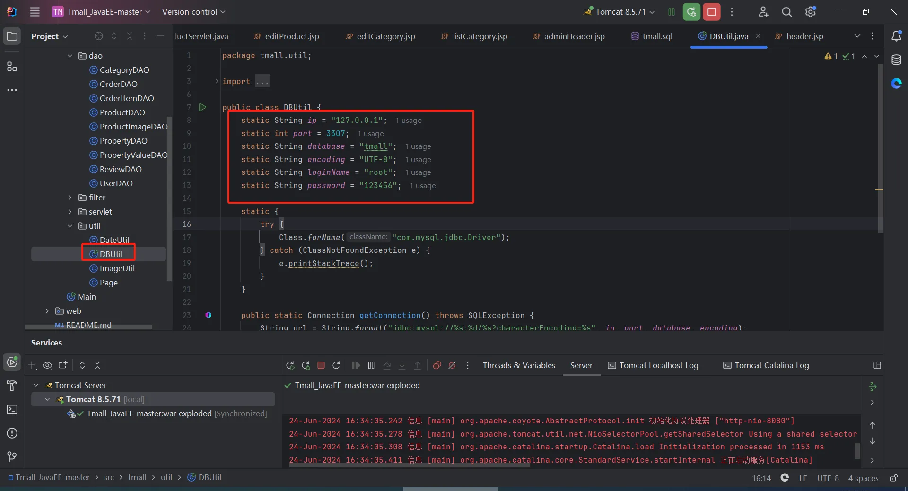
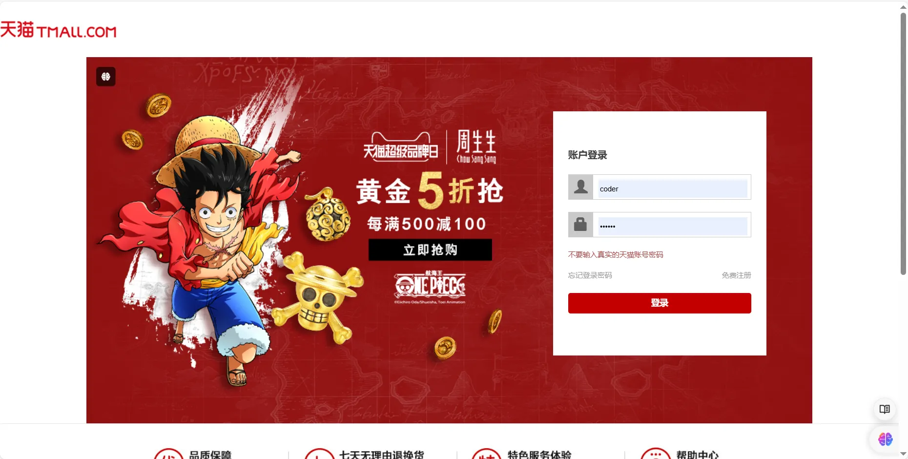
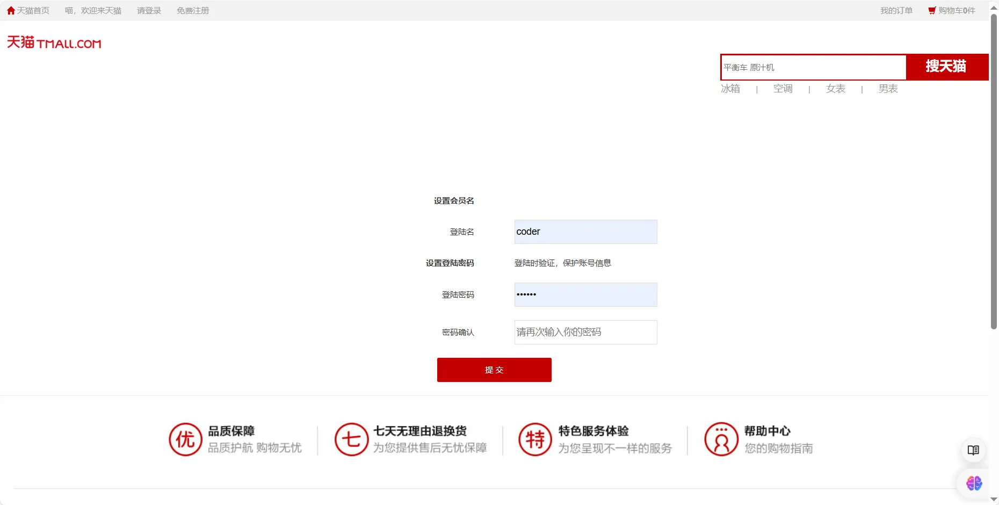
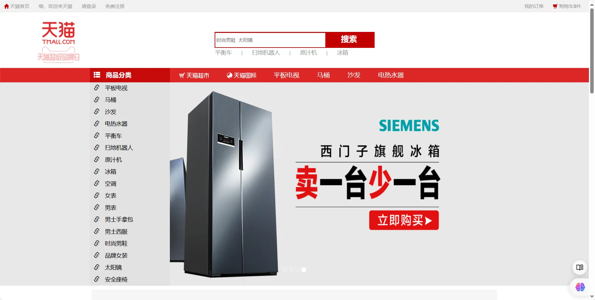
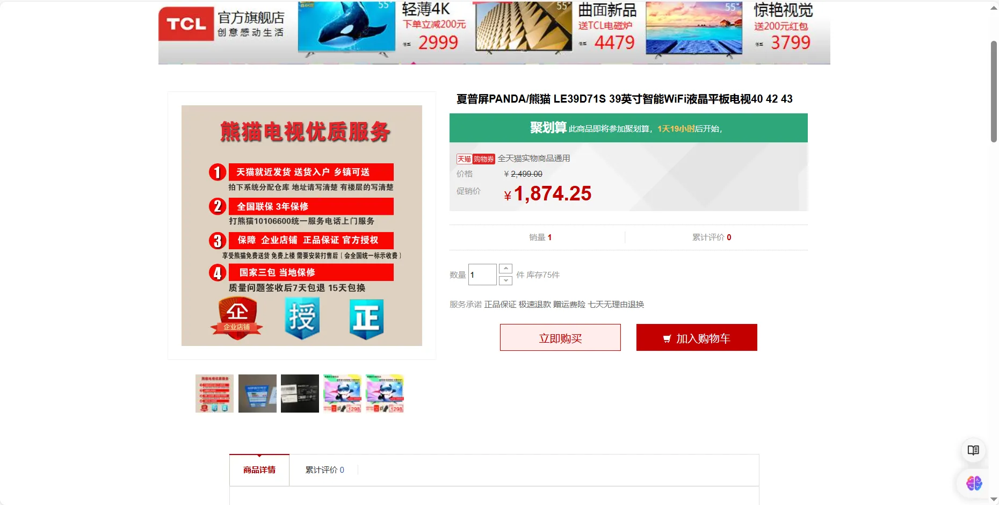
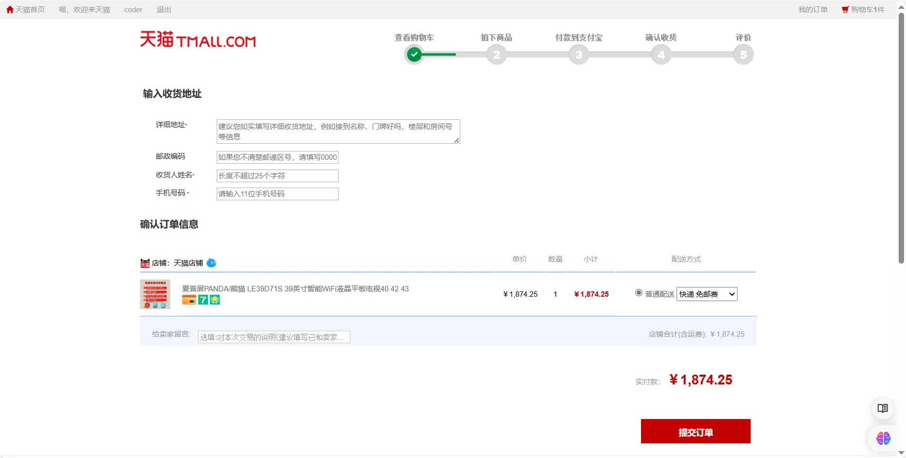
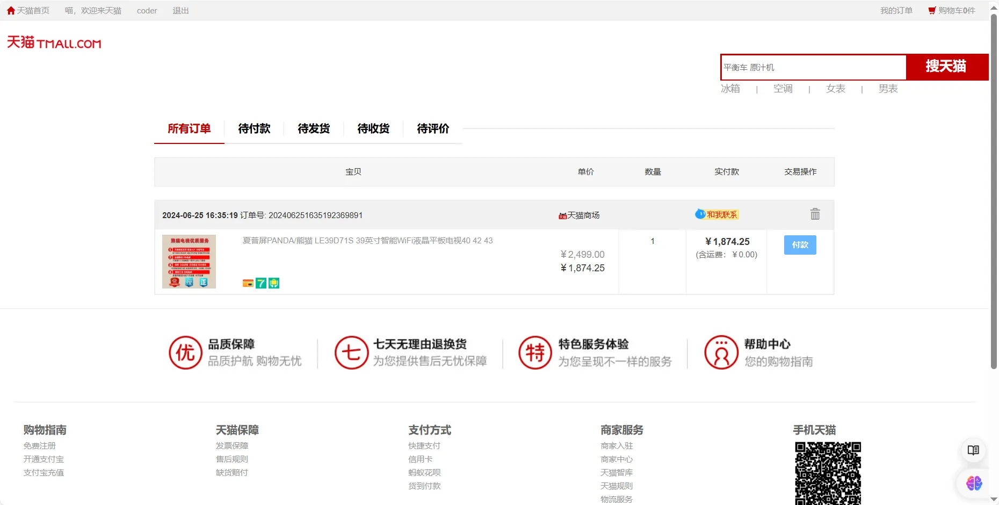

# JSP+Servlet+Mysql实现的模仿天猫网站

学习Java Web开发是一个很好的开始，特别是对于新手来说，模仿天猫网站的项目是一个非常好的练手项目。通过这个项目，你可以学到很多关于Java Web开发的知识和技巧，包括前端和后端的开发技术。

**「难度等级：新手」**

## 项目来源

> [https://github.com/czwbig/Tmall_JavaEE](https://github.com/czwbig/Tmall_JavaEE)

## 开发环境准备

在开始开发之前，我们需要准备好开发环境。以下是我们需要的工具和软件：

- **MySQL 5.7**：用于存储和管理我们的数据。MySQL是一个关系型数据库管理系统，能够处理大量的数据存储和查询。下载安装MySQL后，你可以使用它来创建数据库和表格，存储用户信息和产品数据。
- **JDK 8**：Java开发工具包，提供了运行Java程序所需的环境。JDK 8是一个稳定的版本，支持许多现代Java特性。安装JDK 8后，你可以编写和运行Java程序。
- **Tomcat 8.5**：一个开源的Web服务器，用于运行我们的Web应用。Tomcat能够处理大量的并发请求，是许多Java Web应用的首选服务器。下载并安装Tomcat后，你可以部署和运行你的Web应用。
- **IntelliJ IDEA**：IDEA是一个功能强大的集成开发环境，支持Java开发。下载并安装IntelliJ IDEA后，可以方便地进行项目管理、代码编写、调试和部署。IDEA提供了许多有用的工具和插件，使开发过程更加高效。

## 核心功能模块

在这个项目中，我们将实现以下核心功能模块：

### 前台

- **首页**：展示热门产品和最新促销信息。用户可以浏览产品，查看详细信息。
- **分类页**：根据产品类别展示产品。用户可以根据类别筛选产品，找到自己需要的商品。
- **查询结果页**：根据用户的搜索关键字展示产品。用户可以输入关键字，搜索相关产品。
- **产品页**：展示产品的详细信息，包括图片、价格、描述等。用户可以查看产品的详细信息，决定是否购买。
- **结算页面**：用户选择购买的产品后，进入结算页面。用户可以在结算页面确认订单信息，选择支付方式。
- **支付页面**：用户选择支付方式后，进入支付页面。用户可以在支付页面完成支付操作。
- **支付成功页面**：支付成功后，展示支付成功信息。用户可以查看支付成功的信息，确认订单已完成。
- **购物车页面**：用户可以将想购买的产品加入购物车。用户可以在购物车页面查看和管理购物车中的产品。
- **我的订单页面**：用户可以查看自己的订单信息。用户可以在我的订单页面查看订单状态，跟踪订单。
- **确认收货页面**：用户收到商品后，可以在确认收货页面确认收货。用户可以在确认收货页面确认订单已完成。
- **确认收货成功页面**：确认收货成功后，展示确认收货成功信息。用户可以查看确认收货成功的信息。
- **进行评价页面**：用户可以对购买的商品进行评价。用户可以在进行评价页面填写评价信息，提交评价。
- **登录页面**：用户可以登录自己的账户。用户可以在登录页面输入用户名和密码，登录账户。
- **注册页面**：用户可以注册新账户。用户可以在注册页面填写注册信息，创建新账户。

### 后台

- **分类管理**：管理员可以管理产品分类。管理员可以添加、修改和删除产品分类。
- **分类属性管理**：管理员可以管理分类属性。管理员可以添加、修改和删除分类属性。
- **产品管理**：管理员可以管理产品信息。管理员可以添加、修改和删除产品。
- **产品属性设置**：管理员可以设置产品属性。管理员可以添加、修改和删除产品属性。
- **产品图片管理**：管理员可以管理产品图片。管理员可以上传、修改和删除产品图片。
- **用户管理**：管理员可以管理用户信息。管理员可以查看、修改和删除用户信息。
- **订单管理**：管理员可以管理订单信息。管理员可以查看、修改和删除订单。

## 前后端技术栈

为了实现上述功能，我们将使用以下技术栈：

### 前端技术栈

- **HTML**：用于构建网页的结构。HTML是网页的基础语言，所有的网页元素都是通过HTML标签来定义的。通过学习HTML，你可以创建网页的基本结构，添加文本、图片、链接等元素。
- **CSS**：用于美化网页的样式。CSS可以控制网页的布局、颜色、字体等，使网页更加美观和用户友好。通过学习CSS，你可以设计出漂亮的网页，提升用户体验。
- **JavaScript**：用于实现网页的交互功能。JavaScript是一种脚本语言，可以在网页中实现动态效果和用户交互。通过学习JavaScript，你可以为网页添加动画、表单验证、数据处理等功能。
- **jQuery**：一个JavaScript库，简化了JavaScript的操作。jQuery提供了许多方便的函数，可以大大简化我们的代码。通过学习jQuery，你可以快速实现复杂的JavaScript功能，提高开发效率。

### 后端技术栈

- **Servlet**：用于处理客户端的请求和响应。Servlet是Java Web开发的核心技术，可以处理HTTP请求和生成HTTP响应。通过学习Servlet，你可以创建动态Web应用，处理用户的请求和数据。
- **JSP**：Java Server Pages，用于动态生成HTML内容。JSP可以嵌入Java代码，使我们能够在网页中动态生成内容。通过学习JSP，你可以创建动态网页，根据用户的操作生成不同的内容。
- **JDBC**：Java数据库连接，用于连接和操作数据库。JDBC提供了一组API，可以让我们方便地操作数据库。通过学习JDBC，你可以连接数据库，执行查询、插入、更新和删除操作。
- **Tomcat**：一个开源的Web服务器，用于部署和运行我们的Web应用。Tomcat能够处理大量的并发请求，是许多Java Web应用的首选服务器。通过学习Tomcat，你可以部署和运行你的Web应用，处理用户的请求。

## 常见问题及解决方案

在开发过程中，你可能会遇到一些常见的问题。以下是一些常见问题及解决方案：

- **数据库连接失败**：检查数据库配置是否正确，确保MySQL服务已启动，并且用户名和密码正确。
- **Tomcat无法启动**：检查Tomcat配置是否正确，确保端口未被占用，并查看Tomcat日志获取详细错误信息。

## 源码下载和运行

1. **下载源码**：访问https://github.com/czwbig/Tmall_JavaEE 下载源码。

PS:若上述地址无法访问，访问[https://github.com/coderzcr/JavaWeb-Project-Source-Share/blob/master/newcomer/preview/NEW202007311522.md](https://github.com/coderzcr/JavaWeb-Project-Source-Share/blob/master/newcomer/preview/NEW202007311522.md)。通过百度网盘下载源码。

2. **导入项目**：将源码导入到IDEA中

3. **数据库创建**： 执行`sql\tmall.sql`文件。

4. **配置环境**：根据开发环境准备部分的要求，配置Tomcat、JDK和在IDEA中，选择“File” -> “Project Structure” -> “Project”，然后设置JDK和Tomcat。

5. **数据库配置修改**：将`src\tmall\util\DBUtil.java`配置文件修改为自己的数据库。

6. **部署项目**：将项目部署到Tomcat服务器上。在IDEA中，选择“Run” -> “Edit Configurations”，然后添加一个新的Tomcat Server配置，选择项目的Web模块。
7. **运行项目**：启动Tomcat服务器，访问系统登录页面。在IDEA中，点击“Run”按钮，启动Tomcat服务器，然后在浏览器中访问`http://localhost:8080/Tmall/home.jsp`。

## 账号密码
页面注册即可

## 界面展示

以下是项目的界面展示：
- **登录页面**：用户可以登录自己的账户。

- **注册页面**：用户可以注册新账户。

- **首页**：展示热门产品和最新促销信息。

- **产品页**：展示产品的详细信息。

- **结算页面**：用户选择购买的产品后，进入结算页面。

- **我的订单页面**：用户可以查看自己的订单信息。

## 总结

这个仿天猫商城源码是一个非常适合新手入门的项目。通过这个项目，你可以学习到Java Web开发的基本知识，掌握前后端技术栈的使用，并且能够独立搭建一个完整的Web应用。希望你在学习和实践的过程中，能够收获满满。如果有任何问题或建议，欢迎留言讨论。

## 声明
- 该项目收集于github，本人只是代为说明使用技术、注意点及启动方式，帮助大家进行学习交流。
- **若通过地址无法下载该项目或无法正常运行，可私信我，本人免费协助。**

--- 

欢迎关注我的公众号“**张有路**”，原创技术文章第一时间推送。

