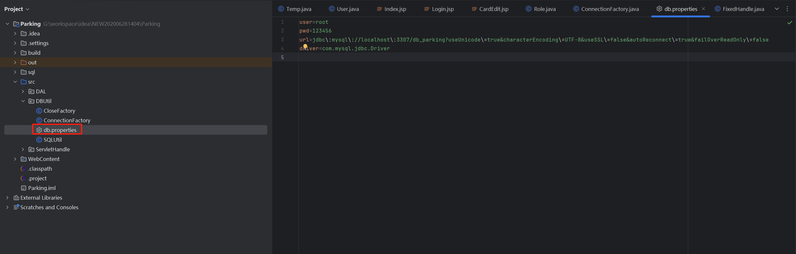
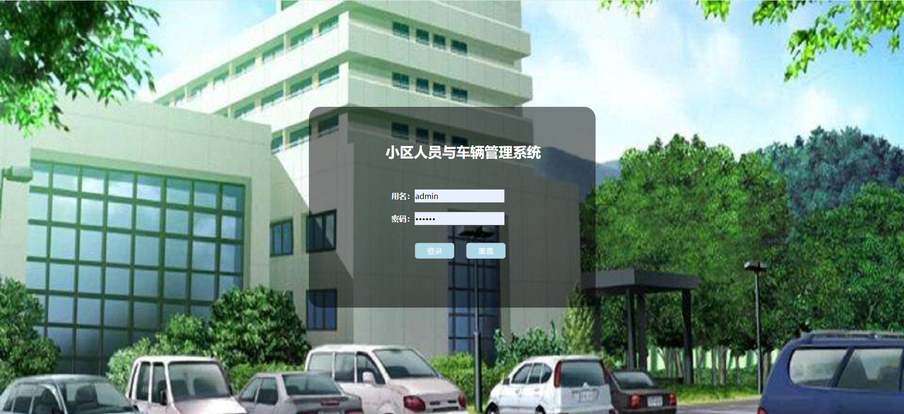

# 小区人员与车辆管理系统源码分享

## 引言

大家好，今天我想和大家分享一个小区人员与车辆管理系统的源码。

这套系统主要是为了帮助小区管理人员更好地管理小区内的人员和车辆信息。

这篇文章将详细介绍如何搭建和运行这个系统。希望能对你有所帮助！

**「难度等级：新手」**
## 项目来源

> 读者coderyang分享
## 开发环境准备

在开始之前，我们需要准备好开发环境。以下是我们需要的工具：

- **MySQL 5.7**：用于存储和管理我们的数据。MySQL是一个关系型数据库管理系统，能够处理大量的数据存储和查询。
- **JDK 8**：Java开发工具包，提供了运行Java程序所需的环境。JDK 8是一个稳定的版本，支持许多现代Java特性。
- **Tomcat 8.5**：一个开源的Web服务器，用于运行我们的Web应用。Tomcat能够处理大量的并发请求，是许多Java Web应用的首选服务器。
- **IntelliJ IDEA**：IDEA是一个功能强大的集成开发环境，支持Java开发。下载并安装IntelliJ IDEA后，可以方便地进行项目管理、代码编写、调试和部署。

确保你已经安装并配置好这些工具，这样我们才能顺利进行开发。

## 核心功能模块

这个系统包含了多个核心功能模块，每个模块都有其独特的功能和作用。下面我们来一一介绍：

- **登录、退出、修改密码**：用户可以通过登录界面输入用户名和密码进行登录。如果登录成功，系统会记录用户的登录状态。用户还可以在登录后修改密码，确保账户安全。退出功能可以让用户安全地退出系统，防止他人使用。
- **角色管理**：管理员可以添加、删除和修改用户角色。不同的角色有不同的权限，例如管理员可以管理所有用户和车辆信息，而普通用户只能查看自己的信息。
- **用户管理**：管理员可以管理系统中的用户信息。包括添加新用户、删除用户以及修改用户信息。用户信息包括用户名、密码、角色等。
- **车位信息管理**：管理员可以管理小区内的车位信息。包括添加新车位、删除车位以及修改车位信息。车位信息包括车位编号、车位位置等。
- **IC卡信息管理**：管理员可以管理IC卡的信息。IC卡用于识别车辆和车主，管理员可以添加、删除和修改IC卡信息。IC卡信息包括卡号、绑定的车主信息等。
- **固定车主停车管理**：管理固定车主的停车信息。固定车主是指长期在小区内停车的车主，管理员可以记录他们的停车信息和费用。
- **临时车辆停车管理**：管理临时车辆的停车信息。临时车辆是指偶尔在小区内停车的车辆，管理员可以记录他们的停车信息和费用。

## 前后端技术栈

为了实现上述功能，我们需要使用一些前后端技术。下面是我们使用的技术栈：

### 前端技术栈

- **HTML**：用于构建网页的结构。HTML是网页的基础语言，所有的网页元素都是通过HTML标签来定义的。
- **CSS**：用于美化网页的样式。CSS可以控制网页的布局、颜色、字体等，使网页更加美观和用户友好。
- **JavaScript**：用于实现网页的交互功能。JavaScript是一种脚本语言，可以在网页中实现动态效果和用户交互。
- **jQuery**：一个JavaScript库，简化了JavaScript的操作。jQuery提供了许多方便的函数，可以大大简化我们的代码。

### 后端技术栈

- **Servlet**：用于处理客户端的请求和响应。Servlet是Java Web开发的核心技术，可以处理HTTP请求和生成HTTP响应。
- **JSP**：Java Server Pages，用于动态生成HTML内容。JSP可以嵌入Java代码，使我们能够在网页中动态生成内容。
- **JDBC**：Java数据库连接，用于连接和操作数据库。JDBC提供了一组API，可以让我们方便地操作数据库。
- **Tomcat**：一个开源的Web服务器，用于部署和运行我们的Web应用。Tomcat能够处理大量的并发请求，是许多Java Web应用的首选服务器。

## 源码下载和运行

为了方便大家使用和学习，本系统的源码已经开源。可以通过以下步骤下载和运行源码：

1. **下载源码**：访问[https://github.com/coderzcr/JavaWeb-Project-Source-Share/blob/master/newcomer/preview/NEW202006281642.md](https://github.com/coderzcr/JavaWeb-Project-Source-Share/blob/master/newcomer/preview/NEW202006281404.md)。通过百度网盘下载源码。
2. **导入项目**：将源码导入到IDEA中。例如，打开IDEA，选择“File” -> “New” -> “Project from Existing Sources”，然后选择下载的源码目录 -> “Import project from external model”  -> "Eclipse",之后一直Next即可。

3. **数据库创建**： 执行`泊车系统\Parking\sql\db_parking.sql`文件。

4. **配置环境**：根据开发环境准备部分的要求，配置Tomcat、JDK和在IDEA中，选择“File” -> “Project Structure” -> “Project”，然后设置JDK和Tomcat。

5. **数据库配置修改**：将`\src\DBUtil\db.properties`配置文件修改为自己的数据库。

6. **部署项目**：将项目部署到Tomcat服务器上。在IDEA中，选择“Run” -> “Edit Configurations”，然后添加一个新的Tomcat Server配置，选择项目的Web模块。
7. **运行项目**：启动Tomcat服务器，访问系统登录页面。在IDEA中，点击“Run”按钮，启动Tomcat服务器，然后在浏览器中访问`http://localhost:8080/Parking`。

## 账号密码
管理员账号：
- 账号：admin
- 密码：admin

## 常见问题及解决方案

在开发和运行这个系统的过程中，我们可能会遇到一些常见的问题。下面是一些常见问题及其解决方案：

在开发和使用教师教学评价系统的过程中，可能会遇到一些常见问题。以下是几个常见问题及其解决方案：

1. **登录失败**：检查用户名和密码是否正确，确保数据库连接正常。
2. **数据无法保存**：检查数据库连接配置，确保表结构和字段名称正确。
3. **表不存在**：代码中关于表名，首字母大写。但数据库中表名为小写，若报表不存，将代码中的表名与数据库保持一致。

## 界面展示

下面是系统的一些界面展示：

- **登录页面**：用户可以在这里输入用户名和密码进行登录。界面简洁明了，输入框和按钮布局合理。

- **用户管理页面**：管理员可以在这里管理系统中的用户信息。每个用户的信息都以表格形式展示，管理员可以方便地进行操作。

- **车位管理页面**：管理员可以在这里管理小区内的车位信息。车位信息以列表形式展示，管理员可以添加、删除和修改车位信息。

- **停车管理页面**：管理员可以在这里管理车辆的停车信息。停车记录以表格形式展示，管理员可以查看每辆车的停车情况和费用。

## 总结

总的来说，这个小区人员与车辆管理系统功能齐全，界面友好，非常适合新手开发者学习和使用。希望通过这篇文章，你能更好地了解和使用这个系统。如果你有任何问题或建议，欢迎在评论区留言。祝你开发顺利！

## 声明
- 该项目收集于网友分享，本人只是代为说明使用技术、注意点及启动方式，帮助大家进行学习交流。
- **若通过地址无法下载该项目或无法正常运行，可私信我，本人免费协助。**

--- 

欢迎关注我的公众号“**张有路**”，原创技术文章第一时间推送。

